# DC-2: CeWL Wordlist to Root via WordPress Brute Force and Sudo Git Escape

## Objective
Continuing from [DC-1](2026-09-28-lab-dc1.md), compromise DC-2 (VulnHub) from host discovery through to root, as further practice for my Ethical Hacking module's practical exam.

## Environment
- Attacker: Kali Linux, 192.168.56.102 (VirtualBox host-only network)
- - Target: DC-2 (VulnHub), 192.168.56.114 — discovered via `nmap -sn`, mapped to the hostname `dc-2` in `/etc/hosts` (the site's own links point at that hostname, so browsing by IP alone breaks navigation)
 
  - ## What I did
  - 1. Confirmed my attacker IP with `ip a`: `eth1` on `192.168.56.102`.
    2. 2. Swept the internal network for live hosts: `nmap -sn 192.168.56.0/24`, which turned up `192.168.56.114` as the target.
       3. 3. Added `192.168.56.114 dc-2` to `/etc/hosts`.
          4. 4. Scanned all ports and service versions: `nmap -sV -p- -T5 dc-2`. Two services: Apache 2.4.10 on port 80, and OpenSSH 6.7p1 on the non-standard port 7744.
             5. 5. Port 80 served a WordPress site ("DC-2 — Just another WordPress site") with a public "Flag" page in the nav menu.
                6. 6. The Flag page held **Flag 1**: a hint that the usual wordlists wouldn't work, to generate a custom one, and to log in as one user to find the next flag.
                   7. 7. Followed the hint and ran CeWL against the site to build a custom wordlist from its own page content: `cewl http://dc-2 | tee our_wordlist`.
                      8. 8. Enumerated WordPress users with WPScan (`wpscan --url http://dc-2 -e u`), which found three: `admin`, `jerry` (via the WP JSON API) and `tom` (via author-ID brute forcing).
                         9. 9. Saved the two non-default usernames to a file: `creds`.
                            10. 10. Ran a password attack over WordPress's XML-RPC endpoint with the found usernames and the CeWL wordlist: `wpscan --url http://dc-2 -U creds -P our_wordlist`. It found valid credentials for both `jerry` and `tom` (redacted throughout this writeup — see provenance.md).
                                11. 11. Logged into `/wp-admin` as `jerry` with the discovered password.
                                    12. 12. Found **Flag 2** on an internal WordPress page: a hint that if WordPress itself can't be exploited further, there's another entry point — pointing at the SSH service found in the initial scan.
                                        13. 13. SSH'd in as `tom` on port 7744, using the password WPScan had also validated for that account.
                                            14. 14. Landed in a restricted shell (`rbash`). `ls -la` showed `flag3.txt` in the home directory, but running `cat` failed with "command not found" — the restricted shell strips `PATH`, so no external binaries resolve.
                                                15. 15. Checked what commands were actually available: `ls -la /home/tom/usr/bin` listed symlinks for `less`, `ls`, `scp` and `vi`.
                                                    16. 16. `vi` is a documented restricted-shell escape (GTFOBins): opened it, ran `:set shell=/bin/sh`, then `:shell` to spawn an unrestricted shell.
                                                        17. 17. From that shell, rebuilt a normal `PATH` so ordinary commands like `cat` would resolve again.
                                                            18. 18. Read `flag3.txt`, which gave **Flag 3**: a riddle pointing at the `su` command and at Jerry chasing Tom.
                                                                19. 19. Switched to `jerry` with `su jerry`, using the same password already found via WPScan.
                                                                    20. 20. Checked jerry's sudo rights: `sudo -l` showed `(root) NOPASSWD: /usr/bin/git` — jerry can run `git` as root with no password.
                                                                        21. 21. `sudo git` is a documented GTFOBins privilege-escalation path: ran `sudo git -p help config`, which drops into a pager; from the pager, `!/bin/sh` spawns a shell. Confirmed root with `whoami`.
                                                                            22. 22. Confirmed full privileges as root: `sudo -l` showed `(ALL : ALL) ALL`.
                                                                                23. 23. Read the final flag: `cat /root/final-flag.txt`, which returned the VM's own congratulations message and creator credit.
                                                                                   
                                                                                    24. ## What I found
                                                                                    25. - A WordPress 4.7.10 install (flagged as outdated by WPScan) with no rate limiting on XML-RPC, so a dictionary attack against two known usernames succeeded even though a generic wordlist wouldn't have — the VM's own page content, harvested with CeWL, was enough to build one that did.
                                                                                        - - A restricted (`rbash`) SSH shell for `tom` that still allowed `vi` among its four permitted commands — `vi` can spawn an arbitrary shell, so the restriction was trivial to bypass.
                                                                                          - - A `sudoers` entry letting `jerry` run `/usr/bin/git` as root with `NOPASSWD` — `git`'s own pager can be escaped to a root shell, so this was equivalent to unrestricted root access.
                                                                                           
                                                                                            - ## How I found it
                                                                                            - 1. Confirming attacker IP
                                                                                              2.    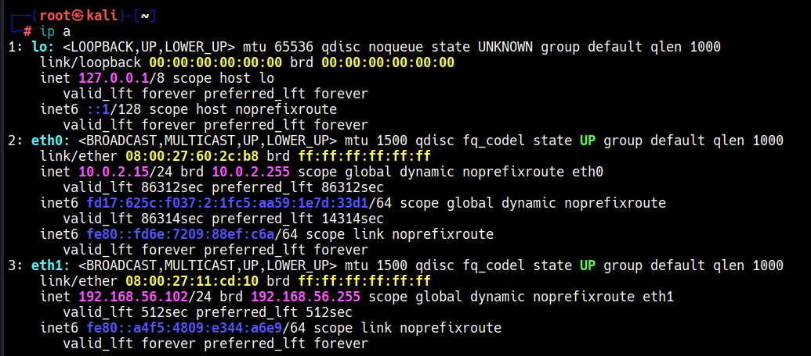
                                                                                              3.2. Host discovery
                                                                                                   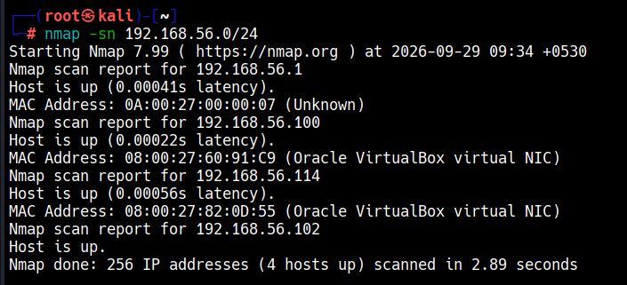
                                                                                                3. Adding the dc-2 hostname to /etc/hosts
                                                                                                4.    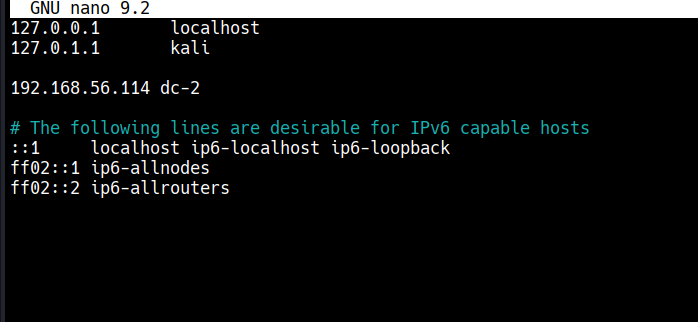
                                                                                                5.4. Full port/service scan
                                                                                                     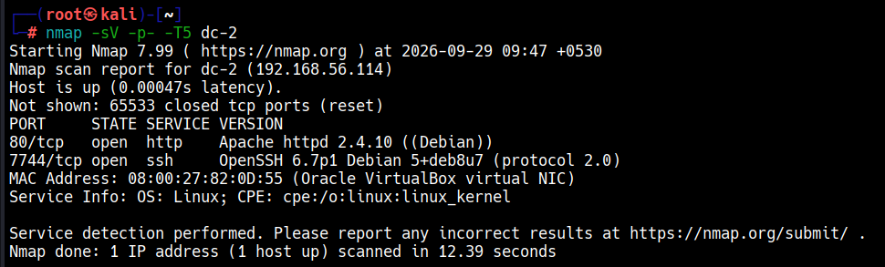
                                                                                                  5. DC-2 WordPress homepage
                                                                                                     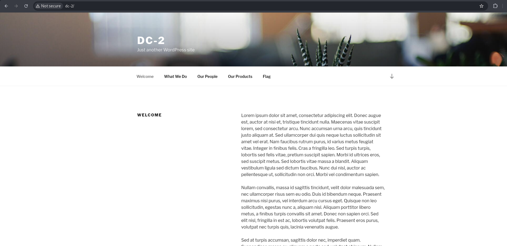
                                                                                                  6. Flag 1, hinting at a custom wordlist
                                                                                                     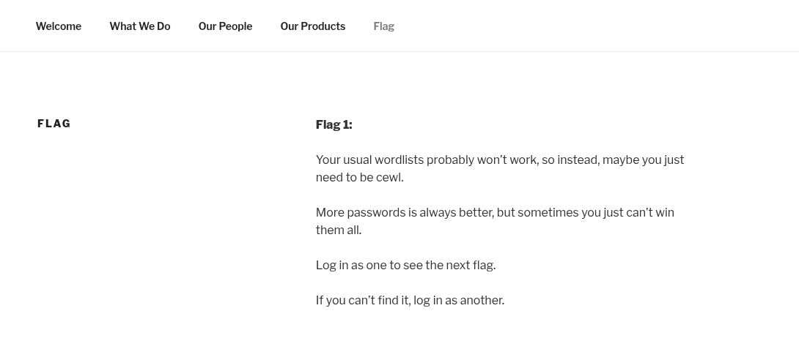
                                                                                                  7. Building a custom wordlist with CeWL
                                                                                                     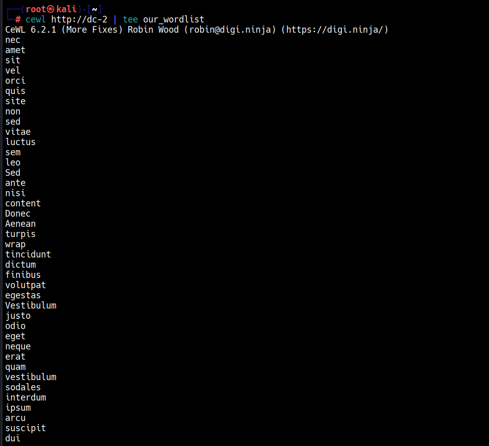
                                                                                                  8. Enumerating WordPress users with WPScan
                                                                                                     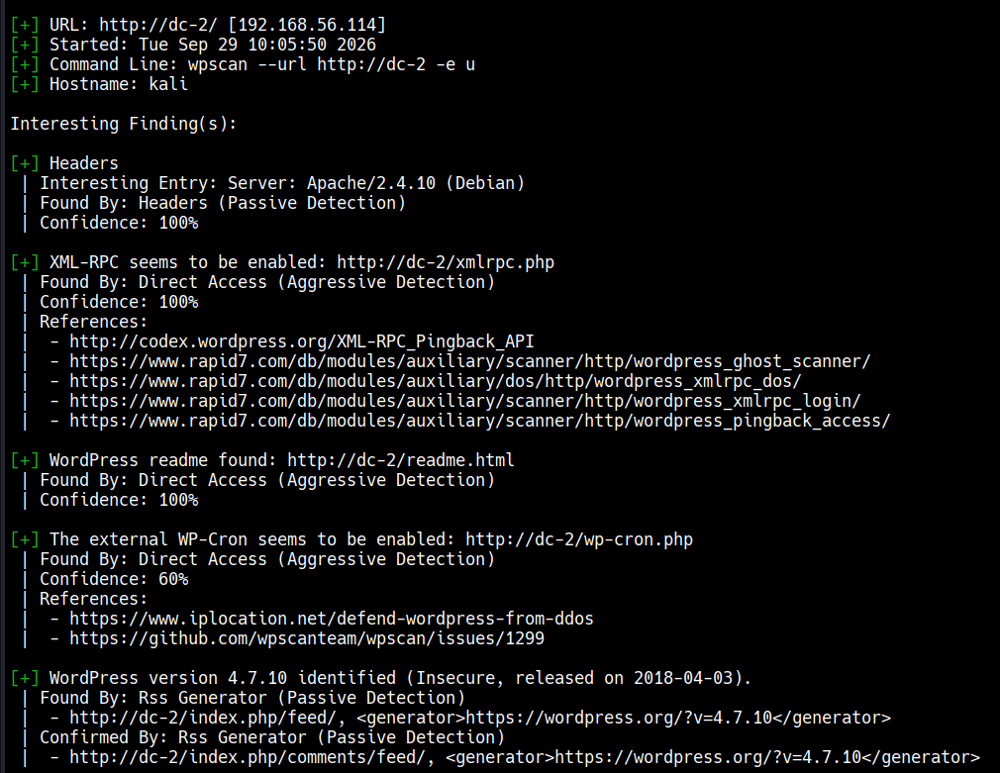
                                                                                                  9. Three usernames identified
                                                                                                     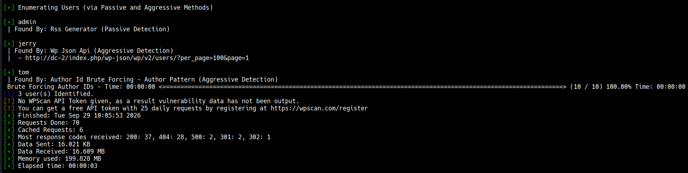
                                                                                                  10. Saving the found usernames to a file
                                                                                                      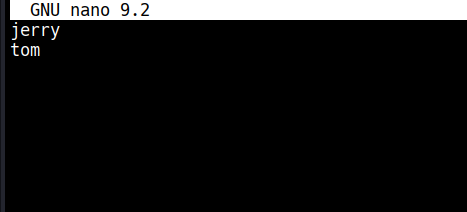
                                                                                                  11. Running the WPScan password attack
                                                                                                      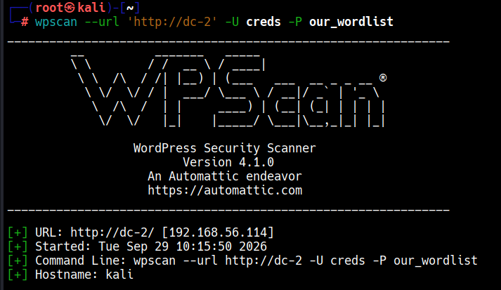
                                                                                                  12. Valid credentials found for both accounts (passwords blurred)
                                                                                                      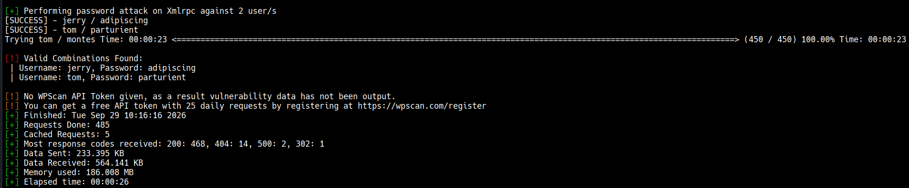
                                                                                                  13. Logged into WordPress admin as jerry
                                                                                                      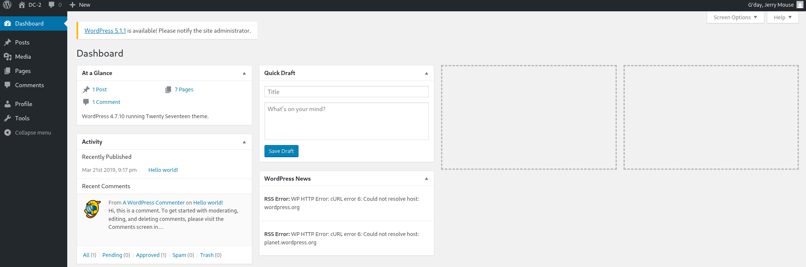
                                                                                                  14. Flag 2, pointing at another entry point
                                                                                                      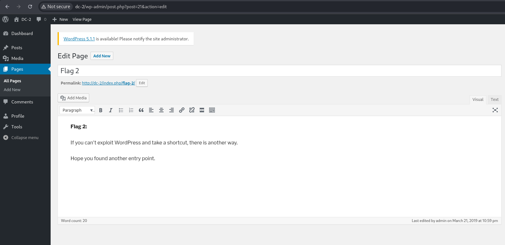
                                                                                                  15. SSH login as tom on port 7744
                                                                                                      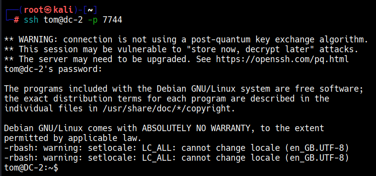
                                                                                                  16. Restricted shell — flag3.txt visible, cat unavailable
                                                                                                      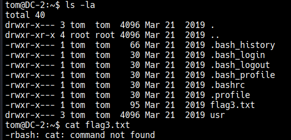
                                                                                                  17. Checking the restricted shell's allowed commands
                                                                                                      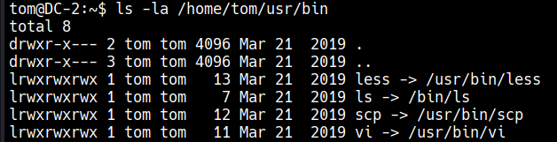
                                                                                                  18. Escaping the restricted shell via vi
                                                                                                      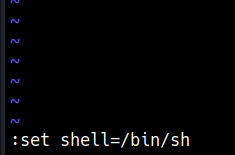
                                                                                                  19. Rebuilding PATH in the unrestricted shell
                                                                                                      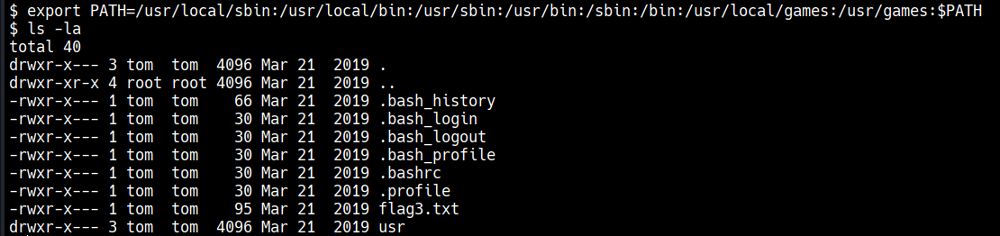
                                                                                                  20. Flag 3, hinting at su
                                                                                                      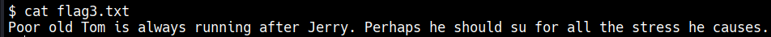
                                                                                                  21. Switching to jerry with su
                                                                                                      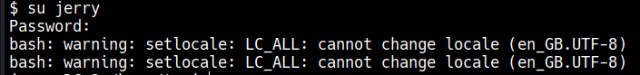
                                                                                                  22. jerry's sudo rights: NOPASSWD git as root
                                                                                                      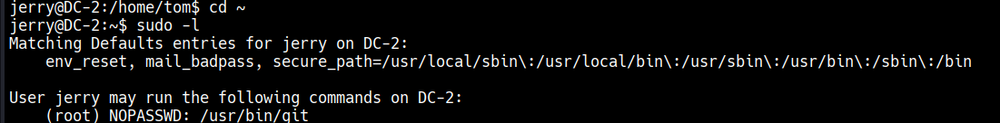
                                                                                                  23. Escaping git's pager to a root shell
                                                                                                      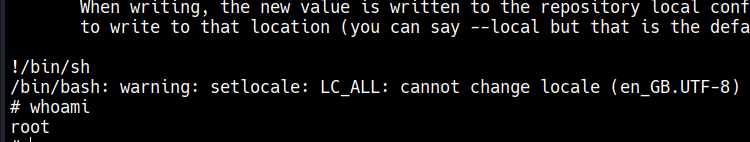
                                                                                                  24. Confirming full root sudo rights
                                                                                                      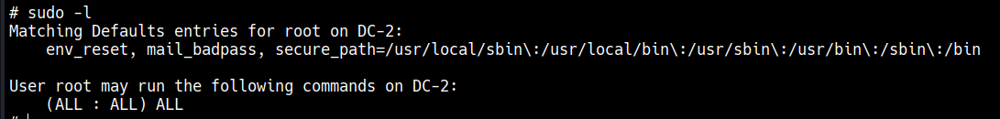
                                                                                                  25. Reading the final flag
                                                                                                      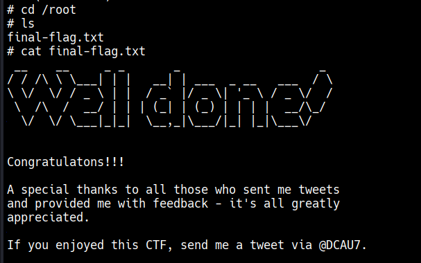

                                                                                                  ## Fix/remediation
                                                                                              - Enforce account lockout or rate limiting on WordPress's XML-RPC endpoint (or disable it entirely if unused), and update WordPress past 4.7.10.
                                                                                              - - Never grant SSH access to a restricted shell that still allows an editor like `vi`, `vim` or `less` — nearly all of them have a documented shell-escape sequence (GTFOBins). A genuinely restricted shell needs a command set with no interactive or `!`-shell escape.
                                                                                                - - Remove the `NOPASSWD: /usr/bin/git` sudoers entry, or wrap it in a narrow, non-interactive script instead of the raw binary — `git`'s pager and several subcommands can be escaped to a shell, so any `sudo git` grant is effectively `sudo ALL`.
                                                                                                  - - Run a periodic sudoers audit against a known-good baseline and cross-reference new entries against GTFOBins before approving them.
                                                                                                   
                                                                                                    - ## Tools used
                                                                                                    - Nmap, CeWL, WPScan, SSH, vi (GTFOBins shell escape), sudo/git (GTFOBins privilege escalation)
                                                                                                   
                                                                                                    - ## MITRE ATT&CK mapping
                                                                                                    - - [T1595.002](https://attack.mitre.org/techniques/T1595/002/) — Active Scanning: Vulnerability Scanning (WPScan)
                                                                                                      - - [T1046](https://attack.mitre.org/techniques/T1046/) — Network Service Discovery (Nmap host/port scans)
                                                                                                        - - [T1110.001](https://attack.mitre.org/techniques/T1110/001/) — Brute Force: Password Guessing (CeWL-built wordlist against WordPress XML-RPC)
                                                                                                          - - [T1078](https://attack.mitre.org/techniques/T1078/) — Valid Accounts (reusing the found WordPress credentials to log into SSH)
                                                                                                            - - [T1059.004](https://attack.mitre.org/techniques/T1059/004/) — Command and Scripting Interpreter: Unix Shell (restricted-shell escape via `vi`)
                                                                                                              - - [T1548.003](https://attack.mitre.org/techniques/T1548/003/) — Abuse Elevation Control Mechanism: Sudo and Sudo Caching (`sudo git` pager escape to root)
                                                                                                               
                                                                                                                - ## Detection
                                                                                                                - - **Web layer:** a burst of POST requests to `xmlrpc.php` from a single source in a short window is the classic WordPress XML-RPC brute-force signature — worth alerting on regardless of whether the wordlist is generic or site-specific.
                                                                                                                  - - **Host layer (shell escape):** a restricted-shell session (`rbash`) whose process tree shows an unrestricted `/bin/sh` or `/bin/bash` child of an interactive editor (`vi`, `vim`, `less`, `man`) is a strong signal — these programs have no legitimate reason to spawn a shell in a locked-down environment.
                                                                                                                    - - **Host layer (sudo escape):** `sudo` invoking `git` (or another non-security tool) that itself spawns a child shell is anomalous — `git` rarely forks an interactive shell during normal use.
                                                                                                                      - - Example Sigma rule (untested against real logs, syntax-checked only):
                                                                                                                        - ```yaml
                                                                                                                          title: Restricted Shell Escape via Editor Pager
                                                                                                                          status: experimental
                                                                                                                          logsource:
                                                                                                                              category: process_creation
                                                                                                                              product: linux
                                                                                                                          detection:
                                                                                                                              selection:
                                                                                                                                  ParentImage|endswith:
                                                                                                                                      - '/vi'
                                                                                                                                      - '/vim'
                                                                                                                                      - '/less'
                                                                                                                                      - '/man'
                                                                                                                                  Image|endswith:
                                                                                                                                      - '/sh'
                                                                                                                                      - '/bash'
                                                                                                                              condition: selection
                                                                                                                          falsepositives:
                                                                                                                              - A legitimate shell-out from an editor by an admin who knows what they're doing
                                                                                                                          level: high
                                                                                                                          ```
                                                                                                                          
                                                                                                                          ## Next steps
                                                                                                                          Continuing through DC-3 onward in the same series, building toward the EH practical exam.
